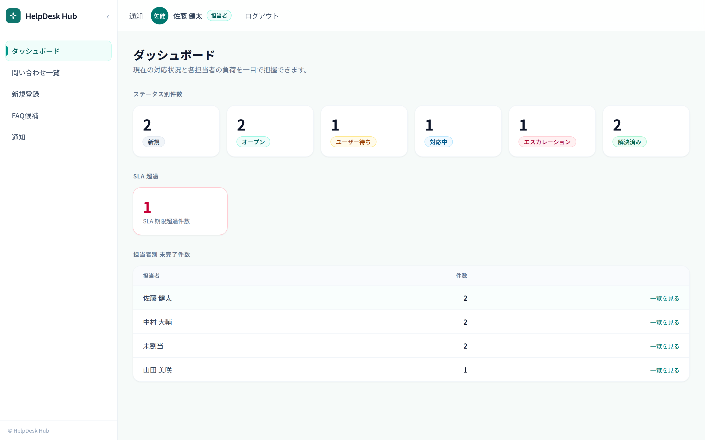
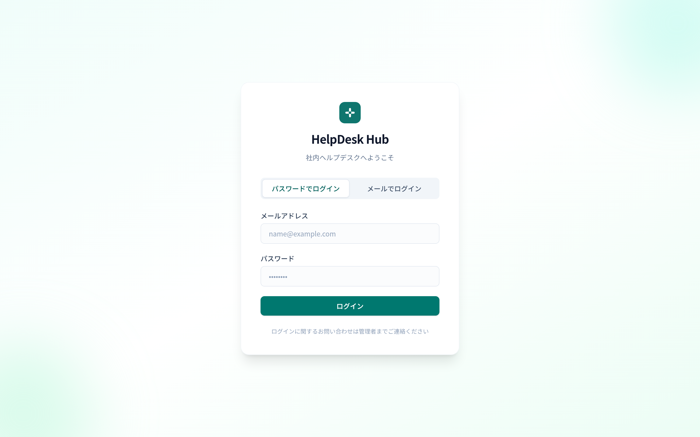
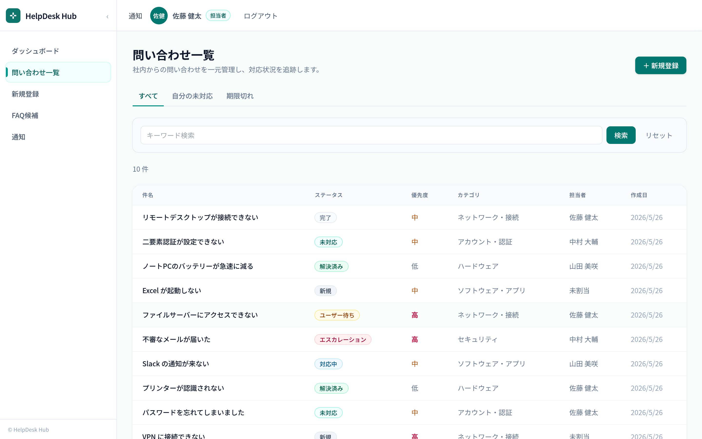
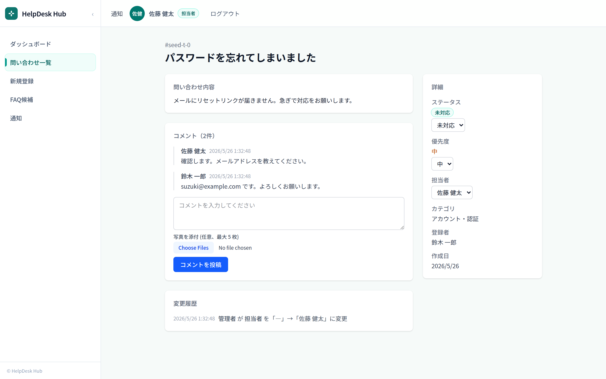

# HelpDesk Hub

## 3分でわかる HelpDesk Hub

HelpDesk Hub は、社内問い合わせの対応漏れ・属人化・SLA遅延を防ぐための
ヘルプデスク向けチケット管理システムです。

主な特徴:

- requester / agent / admin のロール別権限管理
- チケット登録、検索、担当者アサイン、コメント、履歴管理
- SLA期限・期限超過の可視化
- FAQ候補化によるナレッジ蓄積
- Vitest / Playwright / GitHub Actions による品質担保

<p align="center">
  
  <br />
  <em>ダッシュボード — ステータス別件数・SLA 超過・担当者別ワークロードを一目で把握</em>
</p>

## なぜ作ったか

社内の問い合わせ対応は「専任チームがいるほどではないが、放っておくと回らない」という中途半端な規模で発生しがちです。
多くの中小企業では、総務や情シス担当者がメール・チャット・口頭での依頼を片手間でさばいており、
専用ツールを導入するほどではないと後回しにされてきました。

その結果、対応状況が個人の記憶や受信トレイに埋もれ、**対応漏れ・二重対応・特定担当者への属人化**が常態化します。
かといって「情シス向けフル機能」の重厚なツールは、こうした現場には設定も運用も重すぎて根付きません。

HelpDesk Hub は、**問い合わせを「チケット」として一元化し、誰が・いつまでに・どこまで対応したかを当たり前に見えるようにする**ことを目的に作りました。
導入の軽さを重視し、DX がまだ進んでいない中小企業でも無理なく回せる最小限のワークフロー（登録 → アサイン → 対応 → 解決 → FAQ 化）に絞り込んでいます。

## 解決したい課題（誰の・何の課題か）

**対象**: 中小企業や、社内ヘルプデスクを片手間で回している総務・情シス担当者。

**課題**: 問い合わせがメール・電話・チャット・口頭・Excel に分散し、「誰が・いつまでに・どこまで対応したか」が見えなくなりがちです。
その結果、月末に「あの件どうなった？」が頻発し、対応漏れや特定担当者への属人化が起きやすくなります。

**解決策**: HelpDesk Hub は問い合わせをチケットとして一元管理し、担当者・対応状況・期限・変更履歴を可視化します。
これにより、対応漏れを防ぎ、属人化を解消することを目的にしています。

## 主な機能

| カテゴリ         | 機能                                                                   |
| ---------------- | ---------------------------------------------------------------------- |
| 認証             | ログイン/ログアウト、ロール別アクセス制御（requester / agent / admin） |
| チケット         | 登録・一覧・詳細・キーワード検索・多条件フィルタ・ページネーション     |
| ワークフロー     | ステータス遷移管理、優先度・担当者アサイン、コメント、変更履歴         |
| SLA              | 解決期限設定・期限間近/超過バッジ表示                                  |
| エスカレーション | 二次対応へのエスカレーション（理由・日時記録、履歴残存）               |
| ダッシュボード   | ステータス別件数、SLA超過件数、担当者別ワークロード                    |
| FAQ候補          | 解決済み問い合わせのFAQ変換（公開/却下管理）                           |
| 通知             | アサイン・エスカレーション時の自動通知、未読バッジ                     |

## 技術スタック

| レイヤー       | 技術                                                |
| -------------- | --------------------------------------------------- |
| フロントエンド | Next.js 15 (App Router), React 19, Tailwind CSS v4  |
| 認証           | Auth.js v5 (next-auth@beta), Credentials プロバイダ |
| ORM            | Prisma 5                                            |
| DB             | PostgreSQL                                          |
| バリデーション | Zod                                                 |
| フォーム       | react-hook-form + @hookform/resolvers               |
| テスト         | Vitest (unit), Playwright (E2E)                     |
| インフラ       | Docker / Docker Compose                             |

## 品質保証（テスト戦略）

「対応漏れを防ぐ」ためのツール自体が壊れていては意味がないため、次の多層的なテスト戦略で品質を担保しています。

- **静的解析**: ESLint / TypeScript による型・コード品質チェック
- **ユニットテスト**: Vitest によるドメインロジック・Repository 単位のテスト（DB に依存しない純粋ロジック）
- **E2E テスト**: Playwright によるログイン・チケット操作・権限制御の自動検証
- **DB を含む検証**: PostgreSQL service container を使った E2E 実行
- **CI**: GitHub Actions による Pull Request / main push 時の自動検証

## スクリーンショット

| ログイン | 問い合わせ一覧 | 問い合わせ詳細 |
| :---: | :---: | :---: |
|  |  |  |
| マジックリンク / パスワードの2方式 | 検索・多条件フィルタ・タブ切替 | コメント・変更履歴・SLA/担当者操作 |

## セットアップ

### Docker を使う場合（推奨）

```bash
cp .env.example .env
# `.env` の NEXTAUTH_SECRET を強い値に設定 (例: `openssl rand -base64 32`)
docker compose up -d
docker compose exec app npx prisma migrate deploy
docker compose exec app npx prisma db seed
```

アプリは http://localhost:3000 で起動します。

> **注意:** `NEXTAUTH_SECRET` が未設定のまま `docker compose up` を実行すると compose 自体が起動に失敗します。本番デプロイでは必ず強いランダム値を設定してください。

### ローカル直接起動

**前提条件:** Node.js 20+, PostgreSQL

```bash
# 依存関係インストール
npm install

# 環境変数設定
cp .env.example .env
# .env の DATABASE_URL と NEXTAUTH_SECRET を編集

# DB マイグレーション & シード
npm run db:migrate
npm run db:seed

# 開発サーバー起動
npm run dev
```

## デフォルトユーザー（seed後）

| メールアドレス         | ロール    | パスワード  |
| ---------------------- | --------- | ----------- |
| requester1@example.com | requester | password123 |
| agent1@example.com     | agent     | password123 |
| admin@example.com      | admin     | password123 |

## メール送信設定（マジックリンク認証 / 通知）

ログイン用マジックリンクと、後続の通知メールに使う送信先は環境変数で切り替えます。

| 環境変数                       | 用途                                                                      |
| ------------------------------ | ------------------------------------------------------------------------- |
| `EMAIL_DRIVER`                 | `smtp`（本番） / `console`（dev・E2E）                                    |
| `EMAIL_FROM`                   | 差出人ヘッダ。`smtp` 経路では必須                                         |
| `SMTP_HOST` / `SMTP_PORT`      | SMTP サーバ。`smtp` 経路では `SMTP_HOST` 必須、ポートは 1〜65535 の整数   |
| `SMTP_USER` / `SMTP_PASSWORD`  | SMTP 認証情報（匿名 SMTP の場合は省略可）                                 |
| `EMAIL_ALLOW_CONSOLE_IN_PROD`  | **CI / E2E 専用** の escape hatch（後述）                                 |

### ⚠️ 本番デプロイ時の注意

**本番では `EMAIL_ALLOW_CONSOLE_IN_PROD` を絶対に設定しないこと。**
本番メール送信は `EMAIL_DRIVER=smtp` と `SMTP_HOST` / `EMAIL_FROM` を必須とします。

- `EMAIL_DRIVER=smtp` 以外で起動した場合、`getEmailSender()` は起動時にエラーを投げます（設定漏れで「メールを確認してください」が表示されるのに実メールが届かない事故を防ぐためのフェイルファスト）。
- `EMAIL_ALLOW_CONSOLE_IN_PROD=true` を併設するとそのチェックを迂回して `console` adapter（stdout + `.magic-link-outbox.jsonl` ファイルへの追記）が使えますが、これは **CI/E2E でテスト用 outbox を読みたい場合専用** です。本番デプロイ環境の `.env` / hosting の環境変数設定にこの値が混入しないよう、構成管理時に明示的に除外してください。

## コマンド一覧

```bash
npm run dev          # 開発サーバー起動
npm run build        # プロダクションビルド
npm run typecheck    # 型チェック
npm run lint         # ESLint
npm run format       # Prettier
npm run test         # Vitest ユニットテスト
npm run test:e2e     # Playwright E2E テスト
npm run db:migrate   # Prisma マイグレーション
npm run db:seed      # シードデータ投入
npm run db:generate  # Prisma クライアント再生成
```

## プロジェクト構成

```
src/
├── app/
│   ├── (app)/              # 認証済みレイアウト
│   │   ├── dashboard/      # ダッシュボード
│   │   ├── tickets/        # チケット一覧・詳細・新規
│   │   ├── faq/            # FAQ候補管理
│   │   └── notifications/  # 通知一覧
│   ├── api/                # API Routes
│   └── login/              # ログイン画面
├── components/layout/      # 共通レイアウト
├── domain/                 # ビジネスロジック
├── features/               # 機能別モジュール
├── lib/                    # ユーティリティ・設定
└── types/                  # 型定義
prisma/
├── schema.prisma
└── seed.ts
docs/                       # 設計資料
tests/                      # ユニットテスト
e2e/                        # E2E テスト
```

## 設計資料

- [ドキュメント目次](docs/index.md)
- [プロジェクト全体解説（PM・非エンジニア向け）](docs/overview.html)
- [要件定義](docs/requirements.html)
- [アーキテクチャ](docs/architecture.html)
- [ER 図](docs/er-diagram.html)
- [画面遷移図](docs/screen-flow.html)
- [セキュリティ / 堅牢性メモ](docs/security.html)
