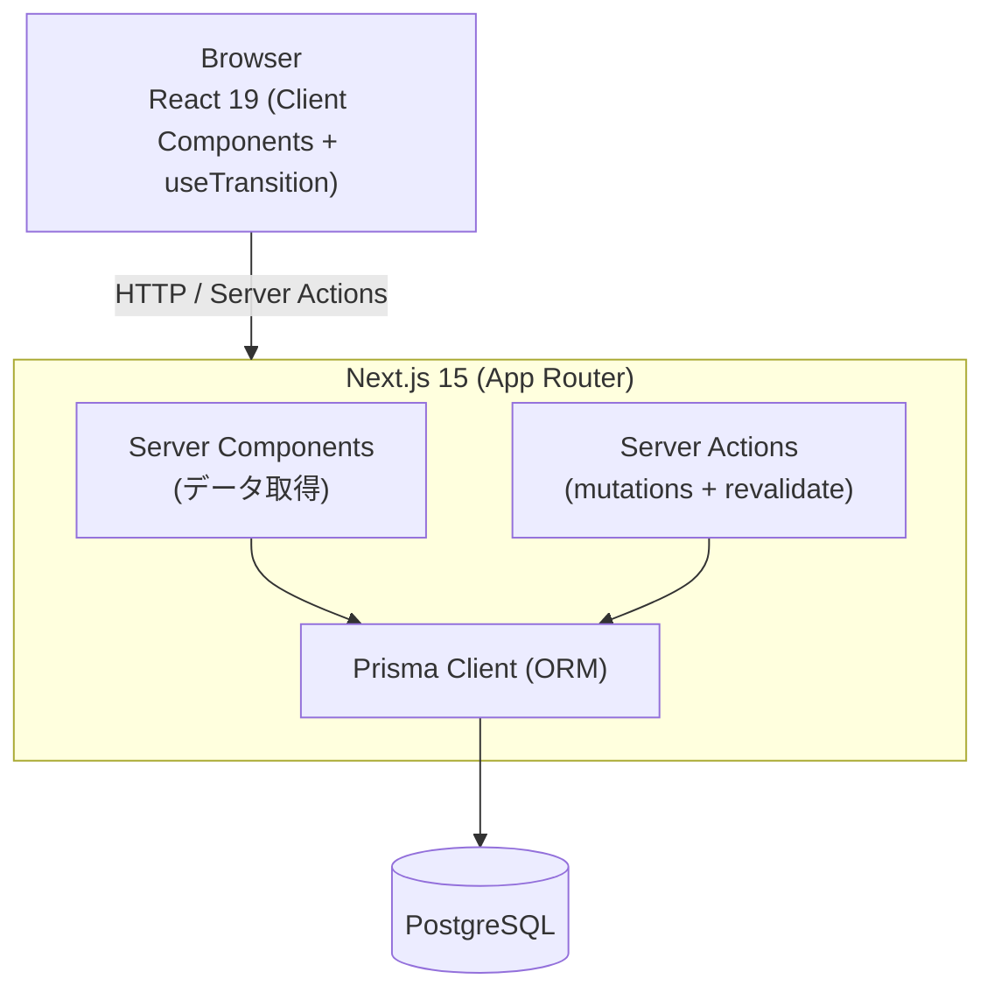
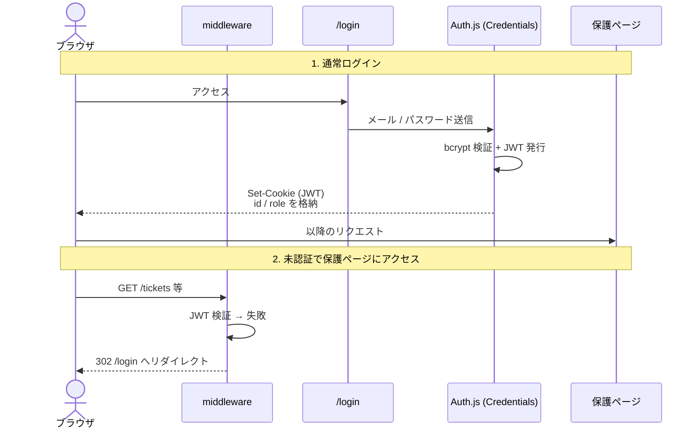
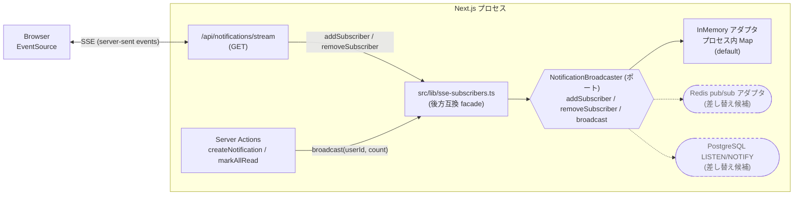

# アーキテクチャ

## 概要

Next.js 15 App Router をベースとしたフルスタック構成。Server Components でデータフェッチ、Server Actions でミューテーションを処理します。

## システム構成

## ディレクトリ構成の考え方

| ディレクトリ             | 役割                                                     |
| ------------------------ | -------------------------------------------------------- |
| `src/app/(app)/`         | 認証済みページ群（Route Group）                          |
| `src/domain/`            | ビジネスロジック（ステータス遷移ルールなど）             |
| `src/features/`          | 機能別モジュール（actions / components）                 |
| `src/lib/`               | 横断的ユーティリティ（prisma, auth, sla, notifications） |
| `src/components/layout/` | 共通 UI（Sidebar, Header）                               |

## 認証フロー

## データミューテーション

Server Actions (`'use server'`) を使用。クライアントから直接呼び出し、完了後に `revalidatePath` でキャッシュを破棄してページを再レンダリング。

## RBAC

| ロール    | チケット閲覧 | チケット更新 | エスカレーション | FAQ管理 |
| --------- | ------------ | ------------ | ---------------- | ------- |
| requester | 自分のみ     | 不可         | 不可             | 不可    |
| agent     | 全件         | 可           | 可               | 可      |
| admin     | 全件         | 可           | 可               | 可      |

## リアルタイム通知（SSE）と水平スケール制約

未読通知数のリアルタイム配信は Server-Sent Events を利用しています。

- `GET /api/notifications/stream` がクライアントの EventSource を受け、購読を `NotificationBroadcaster` ポートに登録します。
- Server Action から `createNotification` / `markAllRead` 等が呼ばれると、同ポートの `broadcast(userId, count)` 経由でそのプロセスに繋がっている購読者にイベントが送られます。

### ポート / アダプタ構成

Issue [#60](https://github.com/izumacha/helpdesk-hub/issues/60) に基づき、SSE 配信経路は `src/data/ports/notification-broadcaster.ts` のポートに抽象化されています。

- ポート: `NotificationBroadcaster` — `addSubscriber` / `removeSubscriber` / `broadcast` の 3 メソッド。
- デフォルトアダプタ: `createInMemoryNotificationBroadcaster`（`src/data/adapters/memory/notification-broadcaster.memory.ts`）。プロセス内 `Map` で購読者を管理する従来の実装。
- コンポジションルート: `src/data/index.ts` が `notificationBroadcaster` を公開します。
- 後方互換の facade: `src/lib/sse-subscribers.ts` はポートに委譲する薄いラッパです。既存の呼び出し元（SSE route, Server Actions）はそのまま。

### 制約

- 既定アダプタは **単一インスタンス前提** です。スタンドアロンの Docker / Node プロセスで動作する限り問題ありませんが、ロードバランサ背後で複数インスタンスを並べた瞬間、別インスタンスで発生した通知は購読中のユーザーに届きません（次回ページロードまで未読カウントがズレる）。

### 水平スケール時の対応方針

ポートの抽象化により、アダプタの差し替えだけで複数インスタンス対応に移行できます。SSE エンドポイント (`src/app/api/notifications/stream/route.ts`) と Server Action 側のコードは変更不要です。

- Redis pub/sub: 各インスタンスがチャンネルを購読し、`broadcast` は publish のみ行う。他インスタンスは subscribe したメッセージを受けて自プロセスのローカル controller に再配信。
- PostgreSQL `LISTEN/NOTIFY`: 既存の DB を再利用できるが、メッセージサイズと接続数の上限に注意。

新しいアダプタを作る際は `NotificationBroadcaster` を実装し、`src/data/index.ts` の `notificationBroadcaster` 生成ロジックを環境変数（例: `NOTIFICATION_BROADCASTER=redis`）などで分岐させてください。
