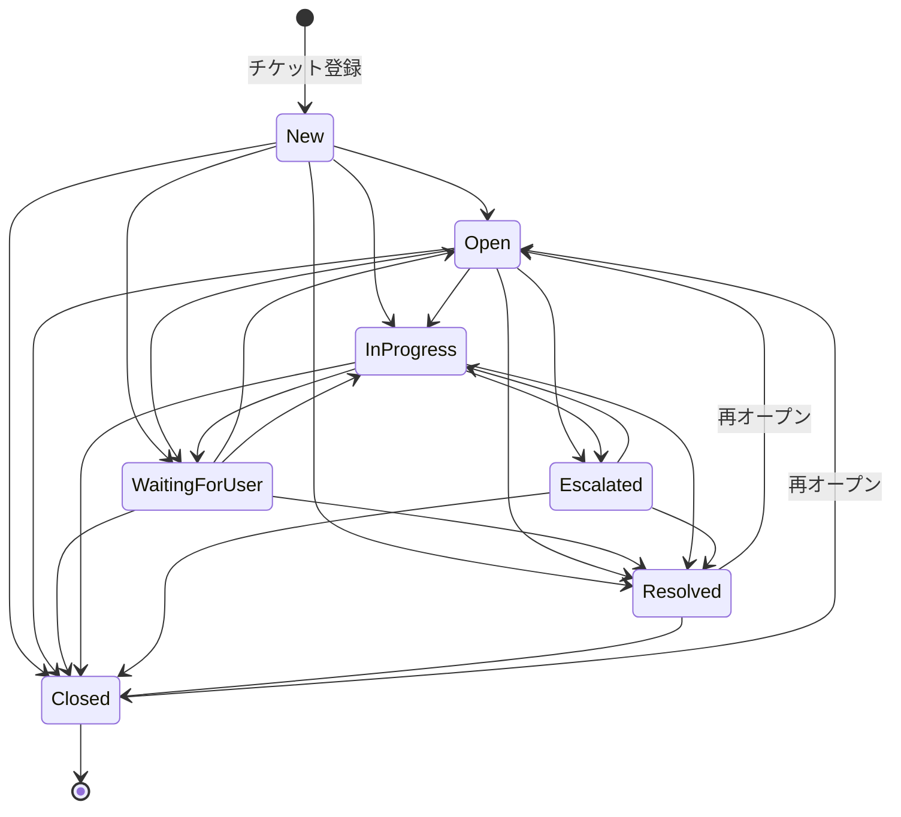

# ER 図

```mermaid
erDiagram
    User {
        string id PK
        string email UK
        string name
        string passwordHash
        Role role
        datetime createdAt
        datetime updatedAt
    }

    Category {
        string id PK
        string name UK
        datetime createdAt
    }

    Ticket {
        string id PK
        string title
        string body
        TicketStatus status
        Priority priority
        datetime firstResponseDueAt
        datetime resolutionDueAt
        datetime firstRespondedAt
        datetime resolvedAt
        datetime escalatedAt
        string escalationReason
        datetime createdAt
        datetime updatedAt
        string creatorId FK
        string assigneeId FK
        string categoryId FK
    }

    TicketComment {
        string id PK
        string body
        datetime createdAt
        string ticketId FK
        string authorId FK
    }

    TicketHistory {
        string id PK
        HistoryField field
        string oldValue
        string newValue
        datetime createdAt
        string ticketId FK
        string changedById FK
    }

    FaqCandidate {
        string id PK
        string question
        string answer
        FaqStatus status
        datetime createdAt
        datetime updatedAt
        string ticketId FK UK
        string createdById FK
    }

    Notification {
        string id PK
        NotificationType type
        string message
        boolean read
        datetime createdAt
        string userId FK
        string ticketId FK
    }

    User ||--o{ Ticket : "creates (creatorId)"
    User ||--o{ Ticket : "assigned (assigneeId)"
    User ||--o{ TicketComment : "authors"
    User ||--o{ TicketHistory : "changes"
    User ||--o{ FaqCandidate : "creates"
    User ||--o{ Notification : "receives"
    Category ||--o{ Ticket : "categorizes"
    Ticket ||--o{ TicketComment : "has"
    Ticket ||--o{ TicketHistory : "has"
    Ticket ||--o| FaqCandidate : "converted to"
    Ticket ||--o{ Notification : "triggers"
```

## ステータス遷移


