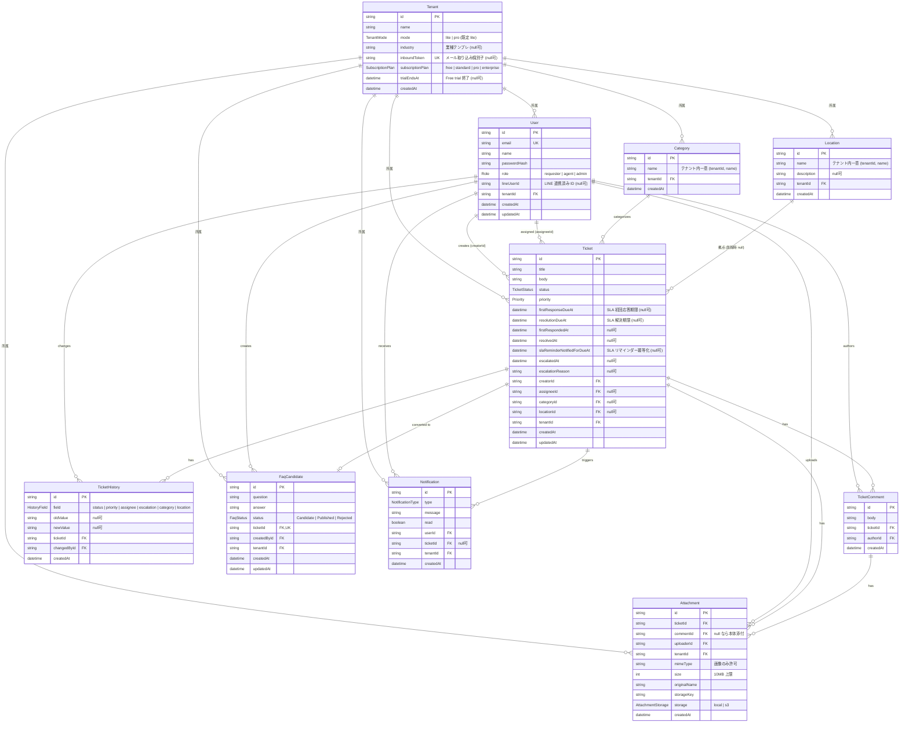
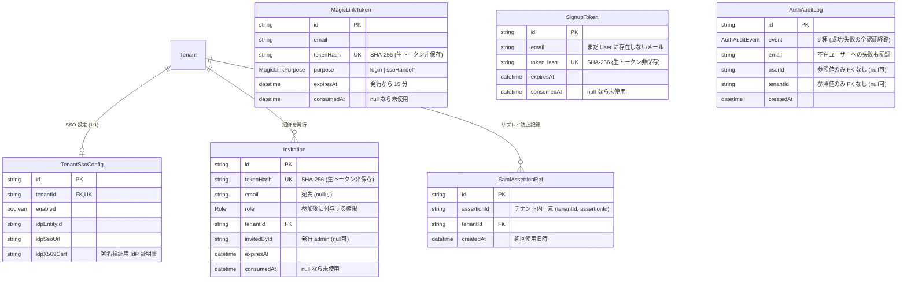
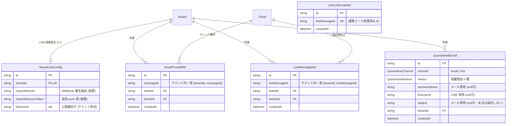
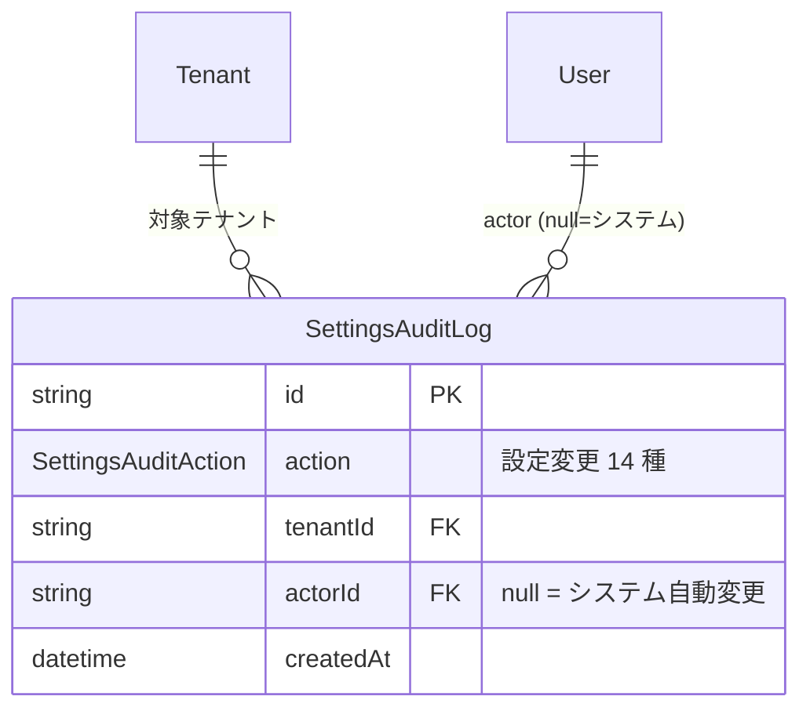
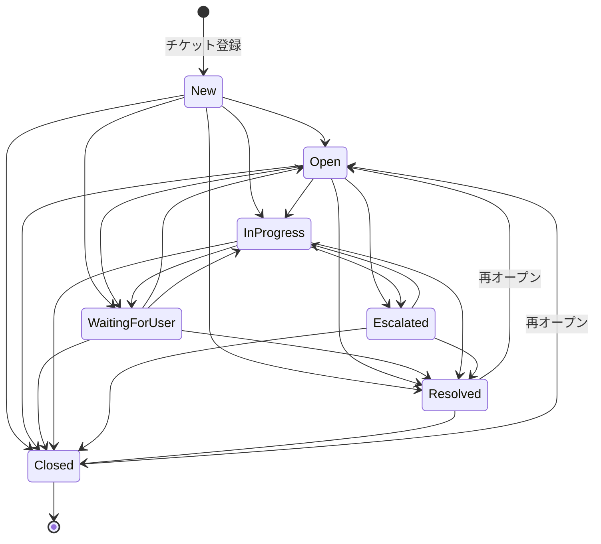
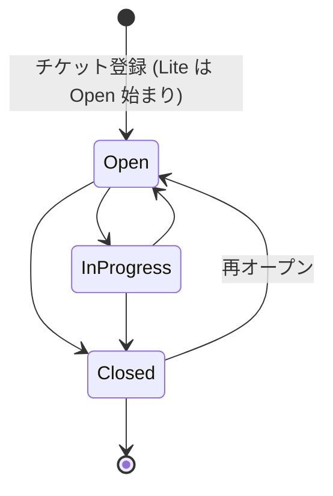

[← ドキュメント目次](./index.md)

# ER 図

> カラム定義の正本は `prisma/schema.prisma`。本書はその構造を領域別に図解したもので、図には主要カラムのみ載せる（全カラム・インデックス・制約はスキーマを参照）。全モデルはマルチテナント境界 `Tenant` を起点にスコープされる（`docs/smb-dx-pivot-plan.md` §5.1）。

## 全体像（4 領域・22 モデル）

| 領域 | モデル |
| --- | --- |
| コアドメイン（チケット） | `Tenant` / `User` / `Category` / `Location` / `Ticket` / `TicketComment` / `TicketHistory` / `FaqCandidate` / `Notification` / `Attachment` |
| 認証・アカウント | `MagicLinkToken` / `SignupToken` / `Invitation` / `TenantSsoConfig` / `SamlAssertionRef` |
| 取り込み・外部連携 | `TenantLineConfig` / `EmailThreadRef` / `LineMessageRef` / `LineLinkCodeRef` / `QuarantinedEmail` |
| 監査ログ | `SettingsAuditLog` / `AuthAuditLog`（＋コアドメインの `TicketHistory`） |

## コアドメイン（チケット）

```mermaid
erDiagram
    Tenant {
        string id PK
        string name
        TenantMode mode "lite | pro (既定 lite)"
        string industry "業種テンプレ (null可)"
        string inboundToken UK "メール取り込み識別子 (null可)"
        SubscriptionPlan subscriptionPlan "free | standard | pro | enterprise"
        datetime trialEndsAt "Free trial 終了 (null可)"
        datetime createdAt
    }

    User {
        string id PK
        string email UK
        string name
        string passwordHash
        Role role "requester | agent | admin"
        string lineUserId "LINE 連携済み ID (null可)"
        string tenantId FK
        datetime createdAt
        datetime updatedAt
    }

    Category {
        string id PK
        string name "テナント内一意 (tenantId, name)"
        string tenantId FK
        datetime createdAt
    }

    Location {
        string id PK
        string name "テナント内一意 (tenantId, name)"
        string description "null可"
        string tenantId FK
        datetime createdAt
    }

    Ticket {
        string id PK
        string title
        string body
        TicketStatus status
        Priority priority
        datetime firstResponseDueAt "SLA 初回応答期限 (null可)"
        datetime resolutionDueAt "SLA 解決期限 (null可)"
        datetime firstRespondedAt "null可"
        datetime resolvedAt "null可"
        datetime slaReminderNotifiedForDueAt "SLA リマインダー冪等化 (null可)"
        datetime escalatedAt "null可"
        string escalationReason "null可"
        string creatorId FK
        string assigneeId FK "null可"
        string categoryId FK "null可"
        string locationId FK "null可"
        string tenantId FK
        datetime createdAt
        datetime updatedAt
    }

    TicketComment {
        string id PK
        string body
        string ticketId FK
        string authorId FK
        datetime createdAt
    }

    TicketHistory {
        string id PK
        HistoryField field "status | priority | assignee | escalation | category | location"
        string oldValue "null可"
        string newValue "null可"
        string ticketId FK
        string changedById FK
        datetime createdAt
    }

    FaqCandidate {
        string id PK
        string question
        string answer
        FaqStatus status "Candidate | Published | Rejected"
        string ticketId FK, UK
        string createdById FK
        string tenantId FK
        datetime createdAt
        datetime updatedAt
    }

    Notification {
        string id PK
        NotificationType type
        string message
        boolean read
        string userId FK
        string ticketId FK "null可"
        string tenantId FK
        datetime createdAt
    }

    Attachment {
        string id PK
        string ticketId FK
        string commentId FK "null なら本体添付"
        string uploaderId FK
        string tenantId FK
        string mimeType "画像のみ許可"
        int size "10MB 上限"
        string originalName
        string storageKey
        AttachmentStorage storage "local | s3"
        datetime createdAt
    }

    Tenant ||--o{ User : "所属"
    Tenant ||--o{ Category : "所属"
    Tenant ||--o{ Location : "所属"
    Tenant ||--o{ Ticket : "所属"
    Tenant ||--o{ FaqCandidate : "所属"
    Tenant ||--o{ Notification : "所属"
    Tenant ||--o{ Attachment : "所属"
    User ||--o{ Ticket : "creates (creatorId)"
    User ||--o{ Ticket : "assigned (assigneeId)"
    User ||--o{ TicketComment : "authors"
    User ||--o{ TicketHistory : "changes"
    User ||--o{ FaqCandidate : "creates"
    User ||--o{ Notification : "receives"
    User ||--o{ Attachment : "uploads"
    Category ||--o{ Ticket : "categorizes"
    Location ||--o{ Ticket : "拠点 (削除時 null)"
    Ticket ||--o{ TicketComment : "has"
    Ticket ||--o{ TicketHistory : "has"
    Ticket ||--o| FaqCandidate : "converted to"
    Ticket ||--o{ Notification : "triggers"
    Ticket ||--o{ Attachment : "has"
    TicketComment ||--o{ Attachment : "has"
```

- `TicketComment` / `TicketHistory` は `tenantId` を持たず、親 `Ticket.tenantId` 経由でテナントを辿る。
- `User.lineUserId` は `@@unique([tenantId, lineUserId])` で「テナント内 1 LINE ユーザー = 1 メンバー」を担保（未連携 null は重複可）。
- `Tenant` には上記のほか、外部通知チャネル設定（Slack / Teams / Chatwork の Webhook・トークン＋直近送信失敗の記録）、Stripe 課金（`stripeCustomerId` / `stripeSubscriptionId` / `stripeSubscriptionStatus` / `stripeEventProcessedAt`）、リマインダー冪等化（`trialReminderLastSentDaysBefore` / `quarantineNotifiedAt`）のカラムがある。

## 認証・アカウント

```mermaid
erDiagram
    Tenant ||--o| TenantSsoConfig : "SSO 設定 (1:1)"
    Tenant ||--o{ Invitation : "招待を発行"
    Tenant ||--o{ SamlAssertionRef : "リプレイ防止記録"

    TenantSsoConfig {
        string id PK
        string tenantId FK, UK
        boolean enabled
        string idpEntityId
        string idpSsoUrl
        string idpX509Cert "署名検証用 IdP 証明書"
    }

    Invitation {
        string id PK
        string tokenHash UK "SHA-256 (生トークン非保存)"
        string email "宛先 (null可)"
        Role role "参加後に付与する権限"
        string tenantId FK
        string invitedById "発行 admin (null可)"
        datetime expiresAt
        datetime consumedAt "null なら未使用"
    }

    SamlAssertionRef {
        string id PK
        string assertionId "テナント内一意 (tenantId, assertionId)"
        string tenantId FK
        datetime createdAt "初回使用日時"
    }

    MagicLinkToken {
        string id PK
        string email
        string tokenHash UK "SHA-256 (生トークン非保存)"
        MagicLinkPurpose purpose "login | ssoHandoff"
        datetime expiresAt "発行から 15 分"
        datetime consumedAt "null なら未使用"
    }

    SignupToken {
        string id PK
        string email "まだ User に存在しないメール"
        string tokenHash UK "SHA-256 (生トークン非保存)"
        datetime expiresAt
        datetime consumedAt "null なら未使用"
    }

    AuthAuditLog {
        string id PK
        AuthAuditEvent event "9 種 (成功/失敗の全認証経路)"
        string email "不在ユーザーへの失敗も記録"
        string userId "参照値のみ FK なし (null可)"
        string tenantId "参照値のみ FK なし (null可)"
        datetime createdAt
    }
```

- `MagicLinkToken` / `SignupToken` は**テナント横断テーブル**（発行時点では認証前でテナント不明）のため、意図的に FK リレーションを持たない。
- `AuthAuditLog` も**意図的に FK を持たない**: 監査証跡は親レコード削除のカスケードで消えてはならない（否認防止）。DB トリガで追記専用（UPDATE 拒否・DELETE は明示フラグ付きトランザクションのみ。`prisma/migrations/20260726000100_add_audit_log_immutability`）。
- SAML SSO の ACS は `MagicLinkToken`（`purpose = ssoHandoff`）を使ってセッションを引き渡す。

## 取り込み・外部連携（メール / LINE）

```mermaid
erDiagram
    Tenant ||--o| TenantLineConfig : "LINE 連携設定 (1:1)"
    Tenant ||--o{ EmailThreadRef : "所属"
    Tenant ||--o{ LineMessageRef : "所属"
    Tenant ||--o{ QuarantinedEmail : "所属"
    Ticket ||--o{ EmailThreadRef : "スレッド継続"
    Ticket ||--o{ LineMessageRef : "二重起票防止"

    TenantLineConfig {
        string id PK
        string tenantId FK, UK
        string channelSecret "Webhook 署名検証 (秘匿)"
        string channelAccessToken "返信 push 用 (秘匿)"
        string botUserId UK "公開識別子 (テナント特定)"
    }

    EmailThreadRef {
        string id PK
        string messageId "テナント内一意 (tenantId, messageId)"
        string ticketId FK
        string tenantId FK
        datetime createdAt
    }

    LineMessageRef {
        string id PK
        string lineMessageId "テナント内一意 (tenantId, lineMessageId)"
        string ticketId FK
        string tenantId FK
        datetime createdAt
    }

    LineLinkCodeRef {
        string id PK
        string lineMessageId UK "連携コード処理済み ID"
        datetime createdAt
    }

    QuarantinedEmail {
        string id PK
        QuarantineChannel channel "email | line"
        QuarantineReason reason "隔離理由 6 種"
        string senderAddress "メール専用 (null可)"
        string lineUserId "LINE 専用 (null可)"
        string subject "メール専用 (null可・本文は保存しない)"
        string tenantId FK
        datetime createdAt
    }
```

- `EmailThreadRef` は In-Reply-To / References ヘッダによるスレッド継続（既存チケットへのコメント追記）の逆引き表。`LineMessageRef` は LINE Webhook 再送（at-least-once）での二重起票防止。いずれもテナント内一意制約でクロステナントの乗っ取りを防ぐ。
- `QuarantinedEmail` は起票せず隔離した受信メール/LINE メッセージの記録（`/quarantine` で admin が閲覧）。本文は保存しない（範囲最小化）。

## 監査ログ

```mermaid
erDiagram
    Tenant ||--o{ SettingsAuditLog : "対象テナント"
    User ||--o{ SettingsAuditLog : "actor (null=システム)"

    SettingsAuditLog {
        string id PK
        SettingsAuditAction action "設定変更 14 種"
        string tenantId FK
        string actorId FK "null = システム自動変更"
        datetime createdAt
    }
```

監査系テーブルは 3 つで役割分担する。いずれも DB トリガで**追記専用**。

| テーブル | 記録対象 | 値の記録 |
| --- | --- | --- |
| `TicketHistory` | チケットの status / priority / assignee / escalation / category / location 変更 | 変更前後の値を記録 |
| `SettingsAuditLog` | SSO・LINE・通知チャネル・拠点・カテゴリ・招待・プラン変更などの設定操作 | **値は記録しない**（秘匿情報を含むため「誰が・いつ・何をしたか」のみ） |
| `AuthAuditLog` | 全認証経路の成功・失敗（パスワード / マジックリンク / SAML SSO） | イベント種別＋メール（不在ユーザーの失敗も記録） |

## Enum 一覧（14 種）

| Enum | 値 |
| --- | --- |
| `Role` | requester / agent / admin |
| `TicketStatus` | New / Open / WaitingForUser / InProgress / Escalated / Resolved / Closed |
| `Priority` | Low / Medium / High |
| `HistoryField` | status / priority / assignee / escalation / category / location |
| `FaqStatus` | Candidate / Published / Rejected |
| `NotificationType` | assigned / escalated / commented / statusChanged / priorityChanged / imported / slaDueSoon / quarantined |
| `TenantMode` | lite / pro |
| `SubscriptionPlan` | free / standard / pro / enterprise |
| `AttachmentStorage` | local / s3 |
| `QuarantineReason` | plan_gate / auth_fail / unknown_sender / thread_forbidden / quota_exceeded / no_agents |
| `QuarantineChannel` | email / line |
| `AuthAuditEvent` | password_login_success / password_login_failure / magic_link_login_success / magic_link_login_failure / sso_login_success / sso_assertion_accepted / sso_assertion_rejected / sso_assertion_replayed / sso_user_not_found |
| `MagicLinkPurpose` | login / ssoHandoff |
| `SettingsAuditAction` | sso_config_update / sso_config_delete / line_config_update / line_config_delete / notification_channels_update / tenant_mode_update / location_create / location_update / location_delete / inbound_token_regenerate / invitation_issue / subscription_plan_update / tenant_create / category_create / category_update / category_delete |

## ステータス遷移

実装上の単一の真実は `src/domain/ticket-status.ts`。テナントの `mode` によって使う遷移表が異なる。

### Pro モード（7 値）

```mermaid
stateDiagram-v2
    [*] --> New : チケット登録
    New --> Open
    New --> WaitingForUser
    New --> InProgress
    New --> Resolved
    New --> Closed
    Open --> InProgress
    Open --> WaitingForUser
    Open --> Escalated
    Open --> Resolved
    Open --> Closed
    WaitingForUser --> Open
    WaitingForUser --> InProgress
    WaitingForUser --> Resolved
    WaitingForUser --> Closed
    InProgress --> WaitingForUser
    InProgress --> Escalated
    InProgress --> Resolved
    InProgress --> Closed
    Escalated --> InProgress
    Escalated --> Resolved
    Escalated --> Closed
    Resolved --> Open : 再オープン
    Resolved --> Closed
    Closed --> Open : 再オープン
    Closed --> [*]
```

### Lite モード（3 値）

Lite テナント（SMB 既定）は `Open` / `InProgress` / `Closed` の 3 値のみ使う（`ALLOWED_TRANSITIONS_LITE`）。起票時の初期ステータスも `New` ではなく `Open`（`initialStatusForMode`）。

```mermaid
stateDiagram-v2
    [*] --> Open : チケット登録 (Lite は Open 始まり)
    Open --> InProgress
    Open --> Closed
    InProgress --> Open
    InProgress --> Closed
    Closed --> Open : 再オープン
    Closed --> [*]
```

> Lite テナントに Pro 時代の旧データ（`Escalated` / `Resolved` 等）が残っている場合は Pro 表へフォールバックして「Lite の 3 値へ戻す経路」を確保する（`getAllowedTransitions`、Pivot Plan §5.2）。
