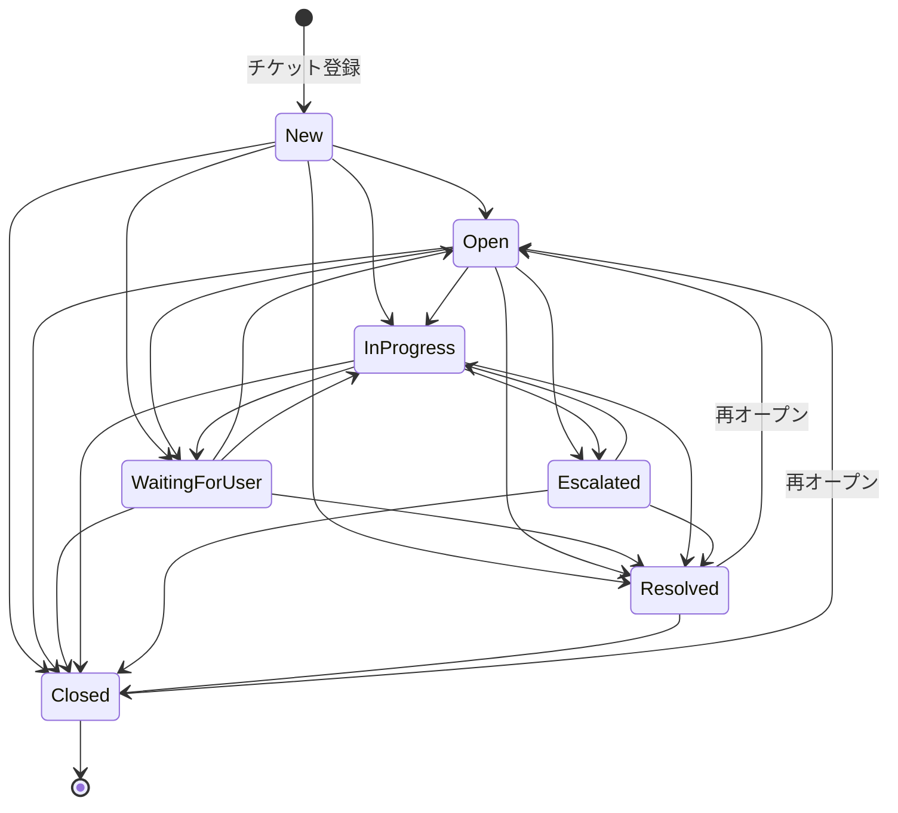

# プロジェクト全体解説

このドキュメントは **PM・QA・ステークホルダーなど非エンジニアの方が最初に読む** ことを想定した、HelpDesk Hub の全体像を業務目線でまとめた入口資料です。技術的な詳細は各専門ドキュメントへリンクしています。

---

## 1. このプロダクトについて

**HelpDesk Hub** は、社内ヘルプデスク・情シス窓口・アプリケーションサポートを対象とした **チケット（問い合わせ）管理 Web アプリケーション** です。

### 解決する課題

| 課題           | このシステムでの対策                                          |
| -------------- | ------------------------------------------------------------- |
| 対応漏れ       | 全問い合わせをチケット化し、ステータスと担当者を可視化        |
| 属人化         | 変更履歴・コメント・FAQ 候補化でナレッジを組織に残す          |
| SLA 遅延       | 初回応答期限・解決期限を自動計算し、期限間近／超過をバッジ表示 |
| 二次対応の遅れ | エスカレーション機能（理由・日時を記録）で引き継ぎを明示化    |

### 利用シーン

- 社内ヘルプデスク（PC トラブル、アカウント発行、ソフトウェア利用相談）
- 情報システム部門の問い合わせ窓口
- アプリケーション運用チームのユーザーサポート

---

## 2. 登場人物（ロール）

ユーザーは 3 種類のロールで管理されます。`agent` と `admin` は実装上ほぼ同等の権限を持ち、画面上もほぼ同じ操作が可能です（`admin` 専用機能は将来拡張予定）。

| ロール          | 立場                       | 主な操作                                                                   |
| --------------- | -------------------------- | -------------------------------------------------------------------------- |
| **requester**   | 依頼者（社内のエンドユーザー） | 問い合わせ起票、自分のチケットの閲覧、自分のチケットへのコメント追加        |
| **agent**       | ヘルプデスク担当者         | 全チケットの閲覧・更新、ステータス／優先度／担当者の変更、エスカレーション、FAQ 候補管理 |
| **admin**       | 管理者                     | agent の全操作（将来的にユーザー管理・カテゴリ管理・SLA 設定が追加予定）   |

> requester は **自分が起票したチケットしか見えません**。agent と admin は組織内の全チケットを横断して扱えます。

---

## 3. 主要機能マップ

要件定義（[`requirements.md`](./requirements.md)）の 3 段階分類に、現在の実装状況を併記しています。

### ✅ MVP（実装済み）

- ログイン／ログアウト、ロール別アクセス制御
- 問い合わせの登録・一覧・詳細
- ステータス更新、優先度・カテゴリ設定、担当者アサイン
- コメント投稿、変更履歴の記録
- キーワード検索、ステータス／カテゴリ／優先度／担当者でのフィルタ、ページネーション

### ✅ 実務拡張（実装済み）

- SLA（初回応答期限・解決期限の自動計算、期限間近／超過バッジ）
- エスカレーション（理由と日時の記録、履歴に永続化）
- FAQ 候補化（解決済みチケットを FAQ 候補に変換し、公開／却下で管理）
- 通知（アサイン・エスカレーション・コメント・ステータス変更時、未読バッジをリアルタイム表示）

### 🚧 アピール拡張（一部のみ実装）

| 機能                 | 状態     | 備考                                                                          |
| -------------------- | -------- | ----------------------------------------------------------------------------- |
| ダッシュボード       | ✅ 実装済 | ステータス別件数、SLA 超過件数、担当者別ワークロード                          |
| 添付ファイル         | ⏳ 未実装 | スクリーンショット・ログのアップロード                                        |
| CSV 出力             | ⏳ 未実装 | チケット一覧のエクスポート                                                    |
| 分析レポート         | ⏳ 未実装 | 平均初回応答時間、平均解決時間、再オープン率、エスカレーション率              |
| 監査ログ画面         | ⏳ 未実装 | 変更履歴は DB に蓄積済み（`TicketHistory`）。閲覧 UI が未着手                 |
| 管理画面             | ⏳ 未実装 | ユーザー管理、カテゴリ管理、SLA 設定                                          |

最新の進捗・優先度は [`docs/issue-backlog.md`](./issue-backlog.md) を参照してください。

---

## 4. 典型的な利用フロー

### シナリオ A: 依頼者が問い合わせを起票して解決まで

1. requester がブラウザで `/login` にアクセスし、社内アカウントでログイン
2. `/tickets/new` で件名・本文・カテゴリ・優先度を入力して登録
3. ステータスは自動で `New` になり、担当者にアサイン通知が届く
4. 担当者がコメントで質問。requester が `/tickets/:id` で返信コメントを投稿
5. 担当者が解決方法を提示し、ステータスを `Resolved` に変更
6. requester が内容を確認して問題なければそのまま、追加質問があれば再オープン

### シナリオ B: 担当者の一日

1. agent が朝にログインし、`/dashboard` で全体状況（ステータス別件数・SLA 超過件数・自分のワークロード）を確認
2. `/notifications` でアサイン通知や新規コメントを確認
3. 自分担当のチケットを順に開き、`In Progress` に変更して対応開始
4. 期限が迫ったチケットは SLA バッジで一目で分かる
5. 自力で解決できないチケットは理由を記録してエスカレーション

### シナリオ C: SLA 超過のリカバリ

1. 初回応答期限・解決期限は登録時の優先度から自動計算される
2. 期限が近づくとチケット詳細にバッジが表示される
3. 担当者は理由を入力してエスカレーション → ステータスが `Escalated` になり、上位担当者に引き継がれる
4. 引き継いだ側は `Escalated` → `In Progress` に戻して対応再開

### シナリオ D: ナレッジ蓄積（FAQ 候補化）

1. 解決済み（`Resolved`）のチケットで agent / admin が「FAQ 候補登録」を実行
2. 質問・回答テキストが `FaqCandidate` として `/faq` の候補一覧に追加される
3. レビュー担当が公開／却下を判断し、公開されたものが社内 FAQ として参照可能になる

---

## 5. 画面と導線

### 画面遷移図

```mermaid
flowchart TD
    Start([ブラウザアクセス]) --> MW{middleware<br/>認証チェック}
    MW -- 未認証 --> Login[/login<br/>ログイン画面]
    MW -- 認証済み --> Dashboard[/dashboard<br/>ダッシュボード]
    Login -- ログイン成功 --> Dashboard

    Dashboard -- 件数カード クリック --> TicketList
    Dashboard -- サイドバー --> TicketList[/tickets<br/>問い合わせ一覧]
    Dashboard -- サイドバー --> FAQ[/faq<br/>FAQ候補一覧]
    Dashboard -- サイドバー --> Notifications[/notifications<br/>通知一覧]

    TicketList -- 新規登録 --> TicketNew[/tickets/new<br/>チケット登録]
    TicketList -- 件名クリック --> TicketDetail[/tickets/:id<br/>チケット詳細]
    TicketList -- フィルタ/検索 --> TicketList
    TicketList -- ページネーション --> TicketList

    TicketNew -- 登録成功 --> TicketDetail

    TicketDetail -- ステータス変更 agent/admin --> TicketDetail
    TicketDetail -- 優先度変更 agent/admin --> TicketDetail
    TicketDetail -- 担当者変更 agent/admin --> TicketDetail
    TicketDetail -- コメント投稿 --> TicketDetail
    TicketDetail -- エスカレーション agent/admin --> TicketDetail
    TicketDetail -- FAQ候補登録 agent/admin,Resolved --> TicketDetail

    FAQ -- 公開/却下 --> FAQ
    Notifications -- 既読にする --> Notifications
    Notifications -- チケットを見る --> TicketDetail
```

### 画面一覧

| パス             | 業務目的                                       | アクセス権限                            |
| ---------------- | ---------------------------------------------- | --------------------------------------- |
| `/login`         | 社内アカウントでサインイン                     | 全員（未認証）                          |
| `/dashboard`     | チーム全体の状況把握、SLA 超過の早期発見       | 全員（認証済み）                        |
| `/tickets`       | 問い合わせを検索・フィルタして対応すべきものを探す | 全員（requester は自分の起票分のみ）   |
| `/tickets/new`   | 新規問い合わせの起票                           | 全員（認証済み）                        |
| `/tickets/:id`   | 個別案件の詳細閲覧・対応・コメントのやり取り   | 全員（requester は自分の起票分のみ）   |
| `/faq`           | 解決済み案件をナレッジ化、公開／却下を管理     | agent / admin のみ                      |
| `/notifications` | 自分宛の通知の確認・既読化                     | 全員（認証済み）                        |

詳細は [`screen-flow.md`](./screen-flow.md) を参照。

---

## 6. チケットのライフサイクル

問い合わせは 7 つのステータスを行き来します。

| ステータス        | 業務的な意味                                                             |
| ----------------- | ------------------------------------------------------------------------ |
| `New`             | 起票直後。まだ担当者が初動を取っていない                                 |
| `Open`            | 受付済み。対応待ち、または初回応答済みで次のアクション待ち              |
| `In Progress`     | 担当者が能動的に対応中                                                   |
| `Waiting for User` | 依頼者からの追加情報・確認を待っている状態（タイマーは止まる業務運用）  |
| `Escalated`       | 二次対応・上位担当者への引き継ぎ中。理由と日時が記録される               |
| `Resolved`        | 解決策を提示済み。依頼者の最終確認待ち。**ここから再オープン可能**       |
| `Closed`          | 完全クローズ。**ここからも再オープン可能**（運用上の救済措置）           |

### 許可されているステータス遷移



> 上記以外の遷移は **サーバー側で拒否** されます（例: `New` → `Escalated` は不可）。許可表は `src/domain/ticket-status.ts` が単一の真実とされ、テストで担保されています。

---

## 7. SLA とエスカレーション

### SLA（サービスレベル目標）

- チケット登録時に **初回応答期限** と **解決期限** が自動計算されます（優先度に応じて時間が変わる）
- チケット詳細・一覧で「期限間近」「期限超過」のバッジが表示される
- 期限超過件数はダッシュボードでも集計表示

### エスカレーション

- agent / admin が「エスカレーション」ボタンから **理由を入力** して実行
- ステータスが `Escalated` に遷移し、`escalatedAt`（日時）と `escalationReason`（理由）が永続化
- 変更履歴（`TicketHistory`）にも記録され、後から経緯を追跡可能
- 上位担当者は `Escalated` → `In Progress` に戻して対応再開

---

## 8. 通知の仕組み

ユーザーには以下のイベントで通知が届きます。

| イベント         | 通知タイミング                       |
| ---------------- | ------------------------------------ |
| `assigned`       | チケットの担当者に自分がアサインされた |
| `escalated`      | 自分が関わるチケットがエスカレーションされた |
| `commented`      | 自分が関わるチケットにコメントが付いた |
| `statusChanged`  | 自分が関わるチケットのステータスが変わった |

- サイドバーの通知バッジは **画面遷移なしでリアルタイムに更新** されます（Server-Sent Events を使用）
- `/notifications` で通知一覧を表示し、個別または一括で既読化可能

> 技術的詳細（SSE 実装、水平スケール時の制約）は [`architecture.md`](./architecture.md#リアルタイム通知sseと水平スケール制約) を参照。

---

## 9. データの輪郭

ビジネスエンティティは大きく分けて 7 種類です（カラム詳細は [`er-diagram.md`](./er-diagram.md) を参照）。

| エンティティ        | 役割                                                              |
| ------------------- | ----------------------------------------------------------------- |
| **User**            | 利用者。ロール（requester / agent / admin）を持つ                |
| **Category**        | チケットの分類（例: PC、ネットワーク、アカウント）                |
| **Ticket**          | 問い合わせ本体。ステータス、優先度、担当、SLA 期限などを保持      |
| **TicketComment**   | チケット上の会話履歴                                              |
| **TicketHistory**   | ステータス・担当者・優先度・エスカレーションの **監査ログ**       |
| **FaqCandidate**    | 解決済みチケットから派生したナレッジ候補                          |
| **Notification**    | 各ユーザー宛の未読／既読通知                                      |

> `TicketHistory` は **誰が・いつ・何を・どう変えたか** を全て永続化しており、監査要件に対応可能です。

---

## 10. 開発状況・既知の制約

### 単一インスタンス前提（重要）

通知のリアルタイム配信（SSE）は **同一プロセス内のメモリ Map** で購読者を管理しています。

- スタンドアロンの Docker / Node プロセス 1 台で運用する限り問題ありません
- ロードバランサ背後で **複数インスタンスを並べた瞬間**、別インスタンスで発生した通知が一部のユーザーに届かなくなります
- 水平スケールが必要になった場合は Redis pub/sub などへのアダプタ差し替えで対応可能（[`architecture.md`](./architecture.md#水平スケール時の対応方針) に方針あり）

### 未実装の主な機能

- 添付ファイル（スクリーンショット・ログ）
- CSV 出力
- 分析レポート画面（履歴データは蓄積済み）
- 管理画面（ユーザー管理・カテゴリ管理・SLA 設定）

優先度は [`docs/issue-backlog.md`](./issue-backlog.md) で管理されています。

---

## 11. 次に読むべきドキュメント

### PM・ステークホルダー向け

- [`requirements.md`](./requirements.md) — 要件定義（スコープ、画面一覧、データモデル、ステータス遷移）
- [`screen-flow.md`](./screen-flow.md) — 画面遷移図とアクセス権限
- [`issue-backlog.md`](./issue-backlog.md) — 開発バックログと優先度

### エンジニア向け

- [`../README.md`](../README.md) — セットアップ手順、コマンド一覧
- [`../CLAUDE.md`](../CLAUDE.md) — 開発規約、ディレクトリ構成の詳細
- [`architecture.md`](./architecture.md) — 技術アーキテクチャ、認証フロー、SSE 設計
- [`er-diagram.md`](./er-diagram.md) — ER 図、ステータス遷移図
- [`security.md`](./security.md) — セキュリティ／堅牢性メモ

### 履歴・調整資料

- [`version-integration.md`](./version-integration.md) — 要件差分の調停ルール
- [`pr-review-report.md`](./pr-review-report.md) — 過去の PR レビュー履歴
