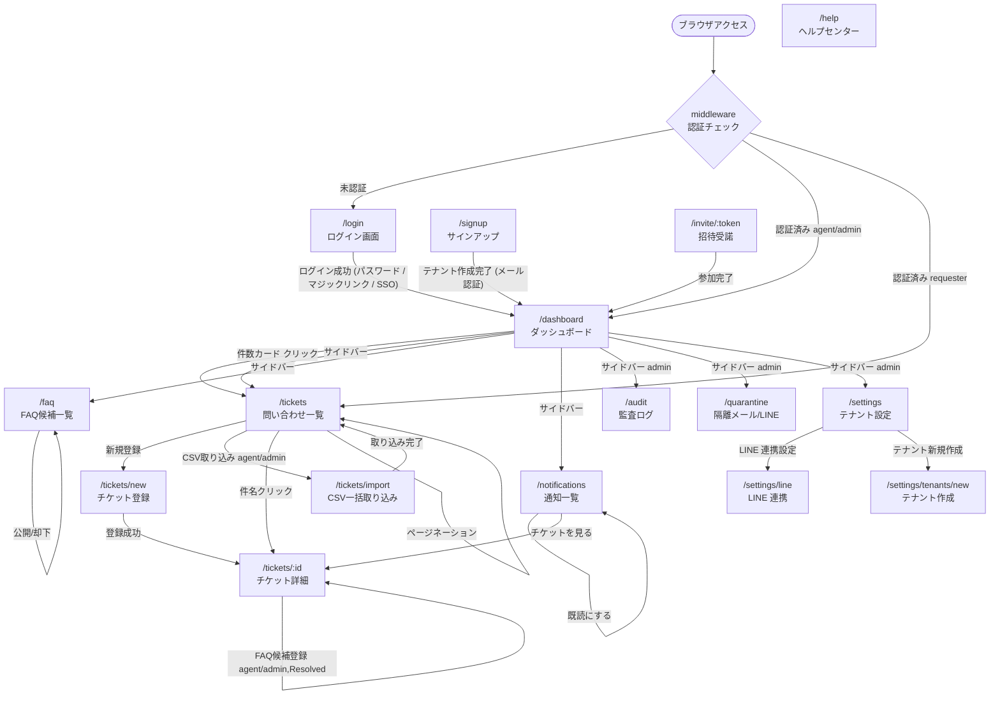

[← ドキュメント目次](./index.md)

# プロジェクト全体解説

このドキュメントは **PM・QA・ステークホルダーなど非エンジニアの方が最初に読む** ことを想定した、HelpDesk Hub の全体像を業務目線でまとめた入口資料です。技術的な詳細は各専門ドキュメントへリンクしています。

> プロダクト方針・ロードマップの**正本（Source of Truth）は [`smb-dx-pivot-plan.md`](./smb-dx-pivot-plan.md)**。本書を含む設計ドキュメントと計画書が食い違う場合は計画書を優先する（調停ルールは [`version-integration.md`](./version-integration.md)）。

---

## 1. このプロダクトについて

**HelpDesk Hub** は、社内ヘルプデスク・情シス窓口・アプリケーションサポートを対象とした **チケット（問い合わせ）管理 Web アプリケーション** です。

現在は **DX 未進展の中小企業（SMB）向けの SaaS へピボット中**で、マルチテナント基盤の上に 2 つの動作モードを持ちます（[`smb-dx-pivot-plan.md`](./smb-dx-pivot-plan.md)）。

- **Lite モード**（SMB 既定）— ステータスを「未対応 / 対応中 / 完了」の 3 値に簡素化し、SLA・エスカレーション・FAQ 候補を隠した最小構成
- **Pro モード** — 本書で説明する 7 ステータス・SLA・エスカレーション等のフル機能

メール・LINE からの問い合わせ取り込み、マジックリンク認証、Stripe による課金プラン（Free / Standard / Pro / Enterprise）にも対応しています。

### 解決する課題

| 課題 | このシステムでの対策 |
| --- | --- |
| 対応漏れ | 全問い合わせをチケット化し、ステータスと担当者を可視化 |
| 属人化 | 変更履歴・コメント・FAQ 候補化でナレッジを組織に残す |
| SLA 遅延 | 初回応答期限・解決期限を自動計算し、期限間近／超過をバッジ表示 |
| 二次対応の遅れ | エスカレーション機能（理由・日時を記録）で引き継ぎを明示化 |

### 利用シーン

- 社内ヘルプデスク（PC トラブル、アカウント発行、ソフトウェア利用相談）
- 情報システム部門の問い合わせ窓口
- アプリケーション運用チームのユーザーサポート

---

## 2. 登場人物（ロール）

ユーザーは 3 種類のロールで管理されます。`agent` と `admin` は実装上ほぼ同等の権限を持ち、画面上もほぼ同じ操作が可能です（`admin` 専用機能は将来拡張予定）。

| ロール | 立場 | 主な操作 |
| --- | --- | --- |
| **requester** | 依頼者（社内のエンドユーザー） | 問い合わせ起票、自分のチケットの閲覧、自分のチケットへのコメント追加 |
| **agent** | ヘルプデスク担当者 | 全チケットの閲覧・更新、ステータス／優先度／担当者の変更、エスカレーション、FAQ 候補管理 |
| **admin** | 管理者 | agent の全操作（将来的にユーザー管理・カテゴリ管理・SLA 設定が追加予定） |

> requester は **自分が起票したチケットしか見えません**。agent と admin は組織内の全チケットを横断して扱えます。

---

## 3. 主要機能マップ

要件定義（[`requirements.md`](./requirements.md)）の 3 段階分類に、現在の実装状況を併記しています。

### ✅ MVP（実装済み）

- ログイン／ログアウト、ロール別アクセス制御
- 問い合わせの登録・一覧・詳細
- ステータス更新、優先度・カテゴリ設定、担当者アサイン
- コメント投稿、変更履歴の記録
- キーワード検索、ステータス／カテゴリ／優先度／担当者でのフィルタ、ページネーション

### ✅ 実務拡張（実装済み）

- SLA（初回応答期限・解決期限の自動計算、期限間近／超過バッジ）
- エスカレーション（理由と日時の記録、履歴に永続化）
- FAQ 候補化（解決済みチケットを FAQ 候補に変換し、公開／却下で管理）
- 通知（アサイン・エスカレーション・コメント・ステータス変更時、未読バッジをリアルタイム表示）

### 🚧 アピール拡張（大半を実装済み）

| 機能 | 状態 | 備考 |
| --- | --- | --- |
| ダッシュボード | ✅ 実装済 | ステータス別件数、SLA 超過件数、担当者別ワークロード |
| 添付ファイル | ✅ 実装済 | チケット・コメントへの画像添付（10MB 上限・MIME 検証） |
| CSV 出力 | ✅ 実装済 | チケット一覧・監査ログ・隔離一覧のエクスポート。CSV **取り込み**（`/tickets/import`）もあり |
| 監査ログ画面 | ✅ 実装済 | `/audit`（admin・Pro/Enterprise 限定）。チケット履歴＋設定変更＋認証イベントを閲覧・CSV 出力 |
| 管理画面 | 🚧 一部実装 | `/settings` でカテゴリ管理・拠点管理・メンバー招待・SSO/LINE/通知チャネル・課金を提供。SLA 設定画面は未実装（定数運用） |
| 分析レポート | ⏳ 未実装 | 平均初回応答時間、平均解決時間、再オープン率、エスカレーション率 |

### ✅ ピボット後に追加された機能（実装済み）

- **マルチテナント**（テナント作成・クロステナント分離・Lite/Pro モード切替）
- **メール取り込み**（テナント専用アドレスへの転送で起票、In-Reply-To によるスレッド継続、不正メールの隔離）
- **LINE 公式アカウント連携（β）**（メッセージからの起票・メンバー紐付け・担当者返信の push）
- **マジックリンク認証・セルフサーブサインアップ・メンバー招待リンク**
- **SAML SSO**（Enterprise プラン限定）
- **Stripe 課金**（Free / Standard / Pro / Enterprise、30 日 Free trial）
- **外部通知チャネル**（Slack / Teams / Chatwork）
- **多拠点対応**（拠点マスタとチケットの拠点紐付け）

最新の進捗・優先度は [`docs/issue-backlog.md`](./issue-backlog.md) と正本 [`smb-dx-pivot-plan.md`](./smb-dx-pivot-plan.md) を参照してください。

---

## 4. 典型的な利用フロー

> 以下のシナリオは **Pro モード**（7 ステータス）の流れ。**Lite モード**（SMB 既定）のテナントでは起票時の初期ステータスが `New` ではなく `Open`（未対応）になり、`Resolved` / `Escalated` は使わない（§6 冒頭の注記参照）。

### シナリオ A: 依頼者が問い合わせを起票して解決まで

1. requester がブラウザで `/login` にアクセスし、社内アカウントでログイン
2. `/tickets/new` で件名・本文・カテゴリ・優先度を入力して登録
3. ステータスは自動で `New` になり、担当者にアサイン通知が届く
4. 担当者がコメントで質問。requester が `/tickets/:id` で返信コメントを投稿
5. 担当者が解決方法を提示し、ステータスを `Resolved` に変更
6. requester が内容を確認して問題なければそのまま、追加質問があれば再オープン

### シナリオ B: 担当者の一日

1. agent が朝にログインし、`/dashboard` で全体状況（ステータス別件数・SLA 超過件数・自分のワークロード）を確認
2. `/notifications` でアサイン通知や新規コメントを確認
3. 自分担当のチケットを順に開き、`In Progress` に変更して対応開始
4. 期限が迫ったチケットは SLA バッジで一目で分かる
5. 自力で解決できないチケットは理由を記録してエスカレーション

### シナリオ C: SLA 超過のリカバリ

1. 初回応答期限・解決期限は登録時の優先度から自動計算される
2. 期限が近づくとチケット詳細にバッジが表示される
3. 担当者は理由を入力してエスカレーション → ステータスが `Escalated` になり、上位担当者に引き継がれる
4. 引き継いだ側は `Escalated` → `In Progress` に戻して対応再開

### シナリオ D: ナレッジ蓄積（FAQ 候補化）

1. 解決済み（`Resolved`）のチケットで agent / admin が「FAQ 候補登録」を実行
2. 質問・回答テキストが `FaqCandidate` として `/faq` の候補一覧に追加される
3. レビュー担当が公開／却下を判断し、公開されたものが社内 FAQ として参照可能になる

---

## 5. 画面と導線

### 画面遷移図

```mermaid
flowchart TD
    Start([ブラウザアクセス]) --> MW{"middleware<br/>認証チェック"}
    MW -- 未認証 --> Login["/login<br/>ログイン画面"]
    MW -- 認証済み agent/admin --> Dashboard["/dashboard<br/>ダッシュボード"]
    MW -- 認証済み requester --> TicketList["/tickets<br/>問い合わせ一覧"]
    Login -- "ログイン成功 (パスワード / マジックリンク / SSO)" --> Dashboard

    Signup["/signup<br/>サインアップ"] -- "テナント作成完了 (メール認証)" --> Dashboard
    Invite["/invite/:token<br/>招待受諾"] -- 参加完了 --> Dashboard
    Help["/help<br/>ヘルプセンター"]

    Dashboard -- 件数カード クリック --> TicketList
    Dashboard -- サイドバー --> TicketList
    Dashboard -- サイドバー --> FAQ["/faq<br/>FAQ候補一覧"]
    Dashboard -- サイドバー --> Notifications["/notifications<br/>通知一覧"]
    Dashboard -- サイドバー admin --> Audit["/audit<br/>監査ログ"]
    Dashboard -- サイドバー admin --> Quarantine["/quarantine<br/>隔離メール/LINE"]
    Dashboard -- サイドバー admin --> Settings["/settings<br/>テナント設定"]

    TicketList -- 新規登録 --> TicketNew["/tickets/new<br/>チケット登録"]
    TicketList -- "CSV取り込み agent/admin" --> TicketImport["/tickets/import<br/>CSV一括取り込み"]
    TicketImport -- 取り込み完了 --> TicketList
    TicketList -- 件名クリック --> TicketDetail["/tickets/:id<br/>チケット詳細"]
    TicketList -- フィルタ/検索 --> TicketList
    TicketList -- ページネーション --> TicketList

    TicketNew -- 登録成功 --> TicketDetail

    TicketDetail -- ステータス変更 agent/admin --> TicketDetail
    TicketDetail -- 優先度変更 agent/admin --> TicketDetail
    TicketDetail -- 担当者変更 agent/admin --> TicketDetail
    TicketDetail -- コメント投稿・画像添付 --> TicketDetail
    TicketDetail -- エスカレーション agent/admin --> TicketDetail
    TicketDetail -- FAQ候補登録 agent/admin,Resolved --> TicketDetail

    FAQ -- 公開/却下 --> FAQ
    Notifications -- 既読にする --> Notifications
    Notifications -- チケットを見る --> TicketDetail

    Settings -- LINE 連携設定 --> SettingsLine["/settings/line<br/>LINE 連携"]
    Settings -- テナント新規作成 --> TenantNew["/settings/tenants/new<br/>テナント作成"]
```

Web 画面以外にも、メール取り込み・LINE 取り込み（それぞれ Webhook 経由）でチケットが起票されます。取り込めなかった受信は `/quarantine` に隔離され、admin が確認できます。

### 画面一覧

| パス | 業務目的 | アクセス権限 |
| --- | --- | --- |
| `/login` | サインイン（パスワード / マジックリンク。Enterprise は SSO も） | 全員（未認証） |
| `/signup` | セルフサーブサインアップ（テナント＋初代管理者の作成） | 全員（未認証） |
| `/invite/:token` | 招待リンクからのメンバー参加 | 全員（未認証・有効なトークン必須） |
| `/help` | ヘルプセンター（使い方・メール連携ガイド） | 全員（未認証） |
| `/dashboard` | チーム全体の状況把握、SLA 超過の早期発見 | 全員（認証済み） |
| `/tickets` | 問い合わせを検索・フィルタして対応すべきものを探す | 全員（requester は自分の起票分のみ） |
| `/tickets/new` | 新規問い合わせの起票 | 全員（認証済み） |
| `/tickets/import` | 既存台帳などからの CSV 一括取り込み | agent / admin |
| `/tickets/:id` | 個別案件の詳細閲覧・対応・コメント・画像添付 | 全員（requester は自分の起票分のみ） |
| `/faq` | 解決済み案件をナレッジ化、公開／却下を管理 | agent / admin のみ |
| `/notifications` | 自分宛の通知の確認・既読化 | 全員（認証済み） |
| `/audit` | 監査ログ（チケット履歴・設定変更・認証イベント）の閲覧と CSV 出力 | admin のみ（Pro / Enterprise 限定） |
| `/quarantine` | 隔離された受信メール / LINE メッセージの確認 | admin のみ |
| `/settings` | テナント設定（カテゴリ・拠点・招待・メール取り込み・SSO・通知チャネル・課金） | admin のみ |

詳細は [`screen-flow.md`](./screen-flow.md) を参照。

---

## 6. チケットのライフサイクル

> 本章は **Pro モード**（7 ステータス）の説明です。**Lite モード**のテナントは「未対応（`Open`）/ 対応中（`InProgress`）/ 完了（`Closed`）」の 3 値のみ使い、起票時の初期ステータスも `New` ではなく `Open` になります（遷移図は [`requirements.md` §5](./requirements.md#5-ステータス遷移) 参照）。

Pro モードの問い合わせは 7 つのステータスを行き来します。

| ステータス | 業務的な意味 |
| --- | --- |
| `New` | 起票直後。まだ担当者が初動を取っていない |
| `Open` | 受付済み。対応待ち、または初回応答済みで次のアクション待ち |
| `In Progress` | 担当者が能動的に対応中 |
| `Waiting for User` | 依頼者からの追加情報・確認を待っている状態（タイマーは止まる業務運用） |
| `Escalated` | 二次対応・上位担当者への引き継ぎ中。理由と日時が記録される |
| `Resolved` | 解決策を提示済み。依頼者の最終確認待ち。**ここから再オープン可能** |
| `Closed` | 完全クローズ。**ここからも再オープン可能**（運用上の救済措置） |

### 許可されているステータス遷移

許可される遷移の一覧と遷移図（Pro 7 値 / Lite 3 値）は、状態遷移の正本である [`requirements.md` §5](./requirements.md#5-ステータス遷移) を参照してください（乖離防止のため遷移図はそちらにのみ掲載）。

> 許可表にない遷移は **サーバー側で拒否** されます（例: `New` → `Escalated` は不可）。許可表は `src/domain/ticket-status.ts` が単一の真実とされ、テストで担保されています。

---

## 7. SLA とエスカレーション

### SLA（サービスレベル目標）

- チケット登録時に **初回応答期限** と **解決期限** が自動計算されます（優先度に応じて時間が変わる）
- チケット詳細・一覧で「期限間近」「期限超過」のバッジが表示される
- 期限超過件数はダッシュボードでも集計表示

### エスカレーション

- agent / admin が「エスカレーション」ボタンから **理由を入力** して実行
- ステータスが `Escalated` に遷移し、`escalatedAt`（日時）と `escalationReason`（理由）が永続化
- 変更履歴（`TicketHistory`）にも記録され、後から経緯を追跡可能
- 上位担当者は `Escalated` → `In Progress` に戻して対応再開

---

## 8. 通知の仕組み

ユーザーには以下のイベントで通知が届きます。

| イベント | 通知タイミング |
| --- | --- |
| `assigned` | チケットの担当者に自分がアサインされた |
| `escalated` | 自分が関わるチケットがエスカレーションされた |
| `commented` | 自分が関わるチケットにコメントが付いた |
| `statusChanged` | 自分が関わるチケットのステータスが変わった |

- サイドバーの通知バッジは **画面遷移なしでリアルタイムに更新** されます（Server-Sent Events を使用）
- `/notifications` で通知一覧を表示し、個別または一括で既読化可能

> 技術的詳細（SSE 実装、水平スケール時の制約）は [`architecture.md`](./architecture.md#リアルタイム通知sseと水平スケール制約) を参照。

---

## 9. データの輪郭

ビジネスエンティティは大きく分けて 7 種類です（カラム詳細は [`er-diagram.md`](./er-diagram.md) を参照）。

| エンティティ | 役割 |
| --- | --- |
| **User** | 利用者。ロール（requester / agent / admin）を持つ |
| **Category** | チケットの分類（例: PC、ネットワーク、アカウント） |
| **Ticket** | 問い合わせ本体。ステータス、優先度、担当、SLA 期限などを保持 |
| **TicketComment** | チケット上の会話履歴 |
| **TicketHistory** | ステータス・担当者・優先度・エスカレーションの **監査ログ** |
| **FaqCandidate** | 解決済みチケットから派生したナレッジ候補 |
| **Notification** | 各ユーザー宛の未読／既読通知 |

> `TicketHistory` は **誰が・いつ・何を・どう変えたか** を全て永続化しており、監査要件に対応可能です。

---

## 10. 開発状況・既知の制約

### 単一インスタンス前提（重要）

通知のリアルタイム配信（SSE）は **同一プロセス内のメモリ Map** で購読者を管理しています。

- スタンドアロンの Docker / Node プロセス 1 台で運用する限り問題ありません
- ロードバランサ背後で **複数インスタンスを並べた瞬間**、別インスタンスで発生した通知が一部のユーザーに届かなくなります
- 水平スケールが必要になった場合は Redis pub/sub などへのアダプタ差し替えで対応可能（[`architecture.md`](./architecture.md#水平スケール時の対応方針) に方針あり）

### 未実装の主な機能

- 分析レポート画面（平均初回応答時間・平均解決時間・再オープン率など。履歴データは蓄積済み）
- SLA 設定画面（期限の計算ルールは現状コード内の定数で運用）

優先度は [`docs/issue-backlog.md`](./issue-backlog.md) と正本 [`smb-dx-pivot-plan.md`](./smb-dx-pivot-plan.md) で管理されています。

---

## 11. 次に読むべきドキュメント

### PM・ステークホルダー向け

- [`smb-dx-pivot-plan.md`](./smb-dx-pivot-plan.md) — **プロダクト方針・ロードマップの正本**（SMB ピボット計画）
- [`requirements.md`](./requirements.md) — 要件定義（スコープ、画面一覧、データモデル、ステータス遷移）
- [`screen-flow.md`](./screen-flow.md) — 画面遷移図とアクセス権限
- [`issue-backlog.md`](./issue-backlog.md) — 開発バックログと優先度

### エンジニア向け

- [`../README.md`](../README.md) — セットアップ手順、コマンド一覧
- [`../CLAUDE.md`](../CLAUDE.md) — 開発規約、ディレクトリ構成の詳細
- [`architecture.md`](./architecture.md) — 技術アーキテクチャ、認証フロー、SSE 設計
- [`er-diagram.md`](./er-diagram.md) — ER 図（全 22 モデル・4 領域）
- [`security.md`](./security.md) — セキュリティ／堅牢性メモ

### 履歴・調整資料

- [`version-integration.md`](./version-integration.md) — 要件差分の調停ルール
- [`pr-review-report.md`](./pr-review-report.md) — 過去の PR レビュー履歴
