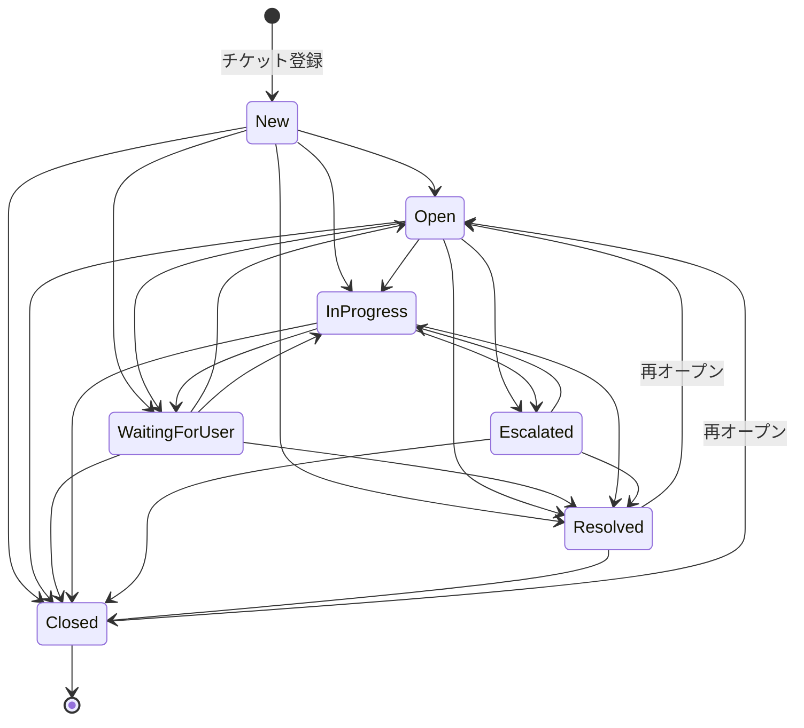
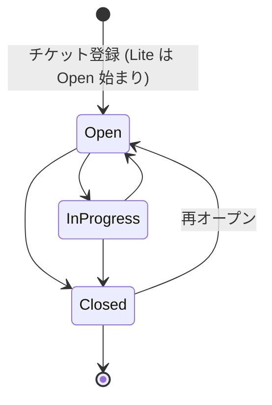

[← ドキュメント目次](./index.md)

# Requirements

> 本書は初期開発時の要件定義。**プロダクト方針の正本は [`smb-dx-pivot-plan.md`](./smb-dx-pivot-plan.md)**（SMB 向けピボット計画）であり、本書と計画書が衝突する場合は計画書を優先する（調停ルールは [`version-integration.md`](./version-integration.md)）。ピボットで追加された要件（マルチテナント・Lite/Pro 二層・メール/LINE 取り込み・マジックリンク認証・課金等）は計画書側に定義がある。

## 1. 概要

- システム名: `helpdesk-hub`
- 目的: ヘルプデスク業務における対応漏れ・属人化・SLA遅延を防ぐ
- 対象: 社内ヘルプデスク、情シス窓口、アプリケーションサポート

## 2. スコープ

### MVP

- 認証（ログイン/ログアウト/ロール別表示）
- 問い合わせ登録、一覧、詳細
- ステータス更新
- 優先度/カテゴリ設定
- 担当者アサイン
- コメント追加
- 変更履歴（ステータス/担当）
- 検索・絞り込み（キーワード、ステータス、カテゴリ、優先度、担当者）

### 実務拡張

- SLA（初回応答期限、解決期限、期限超過/期限間近）
- エスカレーション（理由・日時記録）
- FAQ候補化（解決済み問い合わせから抽出）
- 添付ファイル（スクリーンショット/ログ）
- 通知（アサイン、期限間近、ステータス更新）

### アピール拡張

- ダッシュボード（件数、SLA超過、カテゴリ別、担当者別、日別）
- 品質指標（平均初回応答時間、平均解決時間、再オープン、エスカレーション率）
- 監査ログ（変更者、変更日時、変更前後）
- 権限管理（依頼者/担当者/管理者）
- CSV出力

## 3. 画面一覧

- ログイン
- ダッシュボード
- 問い合わせ一覧
- 問い合わせ詳細
- 問い合わせ登録
- FAQ候補一覧
- 分析レポート
- 管理画面
  - ユーザー管理
  - カテゴリ管理
  - SLA設定

## 4. データモデル（主要）

コアドメインの主要モデル（`prisma/schema.prisma` が正本。全 22 モデルの構造は [`er-diagram.md`](./er-diagram.md) を参照）:

- `Tenant`（マルチテナント境界・Lite/Pro モード・課金プラン）
- `User`
- `Ticket`
- `TicketComment`
- `TicketHistory`（変更履歴 = チケット監査ログ）
- `Category`
- `Location`（拠点）
- `Attachment`（添付ファイル）
- `FaqCandidate`
- `Notification`

補足（[`version-integration.md`](./version-integration.md) の統合方針どおり）:

- **優先度・ステータスはテーブルではなく enum**（`Priority` / `TicketStatus`）で実装する。
- **エスカレーションは独立テーブルにせず** `Ticket` 上の `escalatedAt` / `escalationReason` ＋ `TicketHistory`（`field = escalation`）で記録する。

### Ticket の主要項目

- id
- title
- body（本文）
- status（enum `TicketStatus`）
- priority（enum `Priority`）
- creatorId（起票者）
- assigneeId（担当者・null 可）
- categoryId（null 可）
- locationId（拠点・null 可）
- tenantId（所属テナント・必須）
- firstResponseDueAt / resolutionDueAt（SLA 期限）
- firstRespondedAt / resolvedAt（実績）
- escalatedAt / escalationReason
- createdAt / updatedAt

## 5. ステータス遷移

テナントの動作モード（`TenantMode`）により使用する遷移表が異なる。いずれもこれ以外の遷移はサーバ側で拒否する。

### Pro モード（7 値）

ステータスは 7 種類（`New` / `Open` / `Waiting for User` / `In Progress` / `Escalated` / `Resolved` / `Closed`）。許可される遷移を以下に示す。

### Lite モード（3 値）

Lite テナント（SMB 既定・[`smb-dx-pivot-plan.md`](./smb-dx-pivot-plan.md) §5.2）は `Open`（未対応）/ `InProgress`（対応中）/ `Closed`（完了）の 3 値のみ使う。起票時の初期ステータスも `New` ではなく `Open`。

Lite テナントに Pro 時代の旧データ（`Escalated` / `Resolved` 等）が残っている場合は Pro 表へフォールバックし、Lite の 3 値へ戻す経路を確保する。

> 実装上の単一の真実は `src/domain/ticket-status.ts` の `ALLOWED_TRANSITIONS`（Pro）と `ALLOWED_TRANSITIONS_LITE`（Lite）。`docs/er-diagram.md` および `docs/overview.md` の遷移図も同じ表に基づく。

## 6. 非機能要件

- TypeScript による型安全性（API、フォーム、状態遷移）
- 業務ルールのサーバ側バリデーション
- 監査可能な変更履歴
- ローカル構築容易性（Docker）
- テスト（単体 + E2E）

> 本要件の差分調停ルールは `docs/version-integration.md` を参照。
