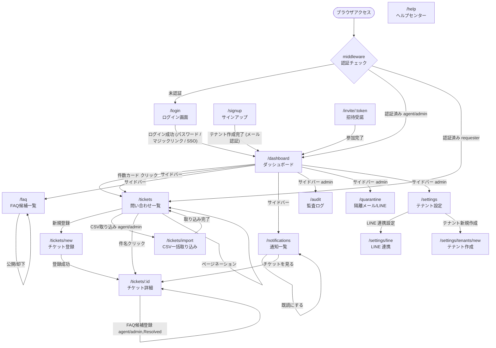

[← ドキュメント目次](./index.md)

# 画面遷移図

> Web 画面以外の起票経路として、メール取り込み（`POST /api/inbound/email`）と LINE 取り込み（`POST /api/inbound/line`）があり、取り込めなかった受信は `/quarantine` に隔離される。SLA リマインダー・トライアルリマインダーは cron が `/api/internal/*` を叩いて通知を生成する。

## 画面一覧

| パス | 説明 | アクセス |
| --- | --- | --- |
| `/login` | ログイン（パスワード / マジックリンクのタブ切替。Enterprise は SSO も） | 全員（未認証） |
| `/signup` | セルフサーブサインアップ（テナント＋初代管理者の作成） | 全員（未認証） |
| `/invite/:token` | 招待リンクの受諾（テナントへのメンバー参加） | 全員（未認証・有効なトークン必須） |
| `/help` | ヘルプセンター（使い方・メール連携ガイド） | 全員（未認証） |
| `/dashboard` | ステータス別件数・ワークロード | 全員（認証済み） |
| `/tickets` | 問い合わせ一覧（検索・フィルタ・ページネーション） | 全員（requesterは自分の分のみ） |
| `/tickets/new` | 問い合わせ新規登録 | 全員（認証済み） |
| `/tickets/import` | CSV 一括取り込み | agent / admin |
| `/tickets/:id` | 問い合わせ詳細・更新・画像添付 | 全員（requesterは自分の分のみ） |
| `/faq` | FAQ候補一覧・公開/却下管理 | agent / admin のみ |
| `/notifications` | 通知一覧・既読管理 | 全員（認証済み） |
| `/audit` | 監査ログ閲覧・CSV 出力 | admin のみ（Pro / Enterprise プラン限定） |
| `/quarantine` | 隔離された受信メール / LINE メッセージの確認 | admin のみ |
| `/settings` | テナント設定（カテゴリ・拠点・メンバー招待・メール取り込み・SSO・通知チャネル・課金） | admin のみ |
| `/settings/line` | LINE 公式アカウント連携設定 | admin のみ |
| `/settings/tenants/new` | テナント新規作成 | admin のみ |
