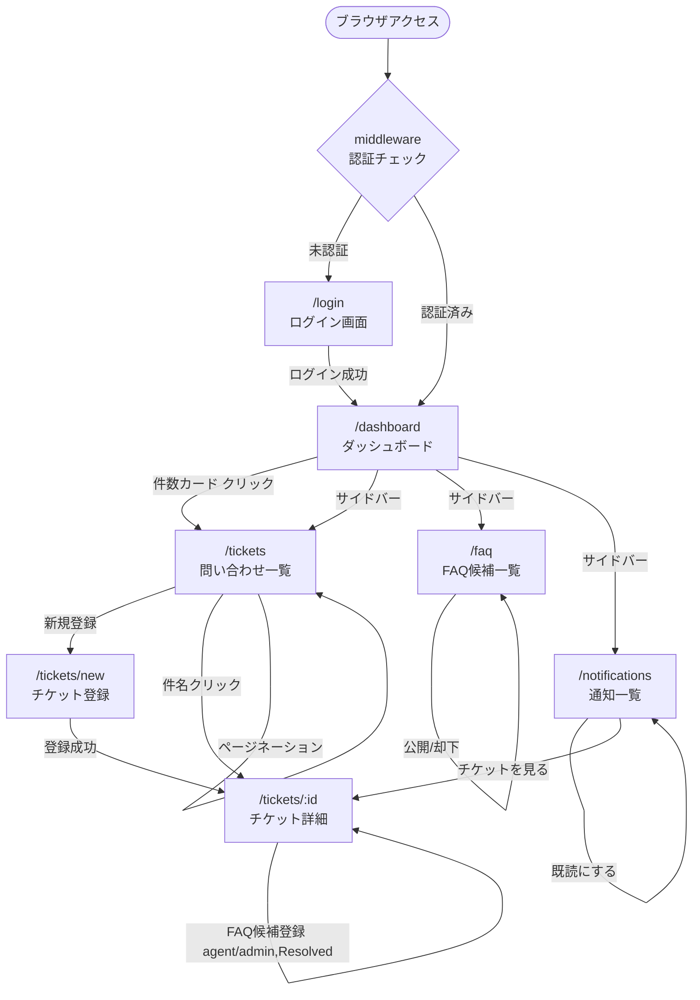

[← ドキュメント目次](./index.md)

# 画面遷移図

## 画面一覧

| パス | 説明 | アクセス |
| --- | --- | --- |
| `/login` | ログイン | 全員（未認証） |
| `/dashboard` | ステータス別件数・ワークロード | 全員（認証済み） |
| `/tickets` | 問い合わせ一覧（検索・フィルタ・ページネーション） | 全員（requesterは自分の分のみ） |
| `/tickets/new` | 問い合わせ新規登録 | 全員（認証済み） |
| `/tickets/:id` | 問い合わせ詳細・更新 | 全員（requesterは自分の分のみ） |
| `/faq` | FAQ候補一覧・公開/却下管理 | agent / admin のみ |
| `/notifications` | 通知一覧・既読管理 | 全員（認証済み） |
