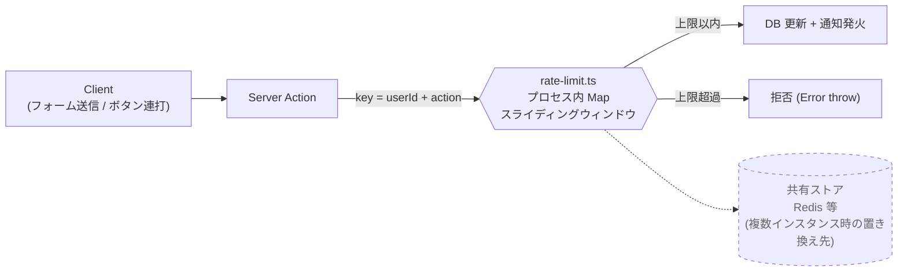

## セキュリティ / 堅牢性メモ

このドキュメントは「実装の解説」ではなく、HelpDesk Hub を運用する際に必要な **脅威想定・制限・制約**をまとめたものです。

---

## 1. 脅威モデル（前提）

- **外部公開**（インターネットからアクセス可能）を前提にする場合
  - クレデンシャル総当たり、スパム、DoS（SSE・検索・一覧API）、権限昇格、CSRF/セッション固定などが主要リスク。
- **社内限定**（VPN/ゼロトラスト配下）を前提にする場合
  - 内部不正（権限濫用）・誤操作・大量操作による負荷が主要リスク。

このリポジトリは「最小限の堅牢化」を備えていますが、外部公開での本番運用は **追加の保護（WAF / Bot対策 / 監査 / インシデント対応）**が必要です。

---

## 2. レート制限（abuse対策）

### 2.1 Server Actions（ミューテーション）

`src/lib/rate-limit.ts` の **プロセス内 Map** によるスライディングウィンドウで、状態変更・コメント・エスカレーション等の連打による通知洪水を防ぎます。

**制約**

- 水平スケール（複数インスタンス）では制限が分散します。
  - 本番で複数台運用する場合は Redis 等の共有ストアに置き換えてください。

### 2.2 API Routes（SSE含む）

- `GET /api/notifications/stream` は長時間接続のため、アプリ/プロキシのタイムアウト設定に影響されます。
- 外部公開の場合はロードバランサ/WAF側で「同一IPの同時接続数」「接続時間」「接続頻度」を制限するのが安全です。

---

## 3. SSE（通知ストリーム）の制約と対策

実装は `docs/architecture.md` に概要があります（SSE + `NotificationBroadcaster` ポート）。

### 3.1 水平スケール

- 既定は in-memory broadcaster のため **単一インスタンス前提**です。
- 水平スケールが必要なら、`NotificationBroadcaster` のアダプタを Redis pub/sub 等に切り替えます。

### 3.2 keep-alive とプロキシ

- SSE は `keep-alive` ping を送っています（`/api/notifications/stream`）。
- 逆プロキシ（Nginx 等）配下ではバッファリングを無効化し、タイムアウトを適切に設定してください。

---

## 4. 認証・セッション

- Auth.js（Credentials）を使用しています。
- `NEXTAUTH_SECRET` は強い値を必ず設定してください（`.env.example` 参照）。

推奨（本番）

- HTTPS 終端を必須にし、Cookie の `Secure` を強制。
- ログイン試行（失敗）回数の制限を、アプリ外（WAF/IdP）で実装する。

---

## 5. 監査・ログ

最低限の監査として、以下を検討してください。

- 重要操作（権限変更、削除、エスカレーション）の監査ログ
- 認証失敗の記録と通知
- レート制限（拒否）の件数モニタリング

