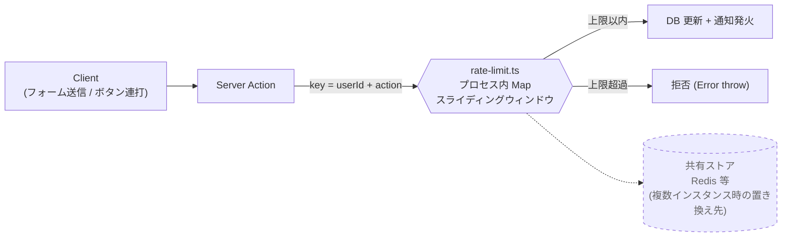

[← ドキュメント目次](./index.md)

# security

## セキュリティ / 堅牢性メモ

このドキュメントは「実装の解説」ではなく、HelpDesk Hub を運用する際に必要な **脅威想定・制限・制約**をまとめたものです。

---

## 1. 脅威モデル（前提）

- **外部公開**（インターネットからアクセス可能）を前提にする場合
  - クレデンシャル総当たり、スパム、DoS（SSE・検索・一覧API）、権限昇格、CSRF/セッション固定などが主要リスク。
- **社内限定**（VPN/ゼロトラスト配下）を前提にする場合
  - 内部不正（権限濫用）・誤操作・大量操作による負荷が主要リスク。

このリポジトリは「最小限の堅牢化」を備えていますが、外部公開での本番運用は **追加の保護（WAF / Bot対策 / 監査 / インシデント対応）**が必要です。

---

## 2. レート制限（abuse対策）

### 2.1 Server Actions（ミューテーション）

`src/lib/rate-limit.ts` の **プロセス内 Map** によるスライディングウィンドウで、状態変更・コメント・エスカレーション等の連打による通知洪水を防ぎます。

```mermaid
flowchart LR
    Client["Client<br/>(フォーム送信 / ボタン連打)"]
    Action["Server Action"]
    Limiter{{"rate-limit.ts<br/>プロセス内 Map<br/>スライディングウィンドウ"}}
    OK["DB 更新 + 通知発火"]
    NG["拒否 (Error throw)"]

    SharedStore[("共有ストア<br/>Redis 等<br/>(複数インスタンス時の置き換え先)")]:::future

    Client --> Action
    Action -- "key = userId + action" --> Limiter
    Limiter -- "上限以内" --> OK
    Limiter -- "上限超過" --> NG
    Limiter -.-> SharedStore

    classDef future stroke-dasharray: 5 5,color:#666;
```

**制約**

- 水平スケール（複数インスタンス）では制限が分散します。
  - 本番で複数台運用する場合は Redis 等の共有ストアに置き換えてください。

### 2.2 API Routes（SSE含む）

- `GET /api/notifications/stream` は長時間接続のため、アプリ/プロキシのタイムアウト設定に影響されます。
- 外部公開の場合はロードバランサ/WAF側で「同一IPの同時接続数」「接続時間」「接続頻度」を制限するのが安全です。

---

## 3. SSE（通知ストリーム）の制約と対策

実装は `docs/architecture.md` に概要があります（SSE + `NotificationBroadcaster` ポート）。

### 3.1 水平スケール

- 既定は in-memory broadcaster のため **単一インスタンス前提**です。
- 水平スケールが必要なら、`NotificationBroadcaster` のアダプタを Redis pub/sub 等に切り替えます。

### 3.2 keep-alive とプロキシ

- SSE は `keep-alive` ping を送っています（`/api/notifications/stream`）。
- 逆プロキシ（Nginx 等）配下ではバッファリングを無効化し、タイムアウトを適切に設定してください。

---

## 4. 認証・セッション

認証経路は 3 つあり、いずれも Auth.js（v5）のセッション（JWT）に合流します。

| 経路 | 実装 | 備考 |
| --- | --- | --- |
| パスワード（Credentials） | `src/lib/password-authorize.ts` | bcrypt 検証 |
| マジックリンク | `src/lib/magic-link-authorize.ts`・`/api/auth/magic-link/callback` | トークンは SHA-256 ハッシュ保存・15 分 TTL・単回使用。サインアップ（`SignupToken`）・招待（`Invitation`）も同方式 |
| SAML SSO（Enterprise 限定） | `/api/auth/sso/[tenantId]/{login,acs,metadata}`・`src/lib/saml.ts` | 署名・Issuer・Audience・期限を検証し、`SamlAssertionRef` でリプレイを拒否。セッション引き渡しは `MagicLinkToken`（`purpose=ssoHandoff`） |

- `NEXTAUTH_SECRET` は強い値を必ず設定してください（`.env.example` 参照）。
- **ログイン試行の制限はアプリ内に実装済み**: `src/lib/login-throttle.ts` がメールアドレス＋IP のスライディングウィンドウでパスワードログインの失敗連打をロックアウトします（マジックリンク経路には意図的に適用しない）。SSO エンドポイントには `src/lib/sso-rate-limit.ts` を適用。ただしこれらは**プロセス内 Map** のため §2.1 と同じ水平スケール制約があり、外部公開時の WAF / Bot 対策は引き続き多層防御として推奨します。

推奨（本番）

- HTTPS 終端を必須にし、Cookie の `Secure` を強制。

---

## 5. 監査・ログ（実装済み）

監査ログは 3 テーブルに分かれ、いずれも DB トリガで**追記専用**（UPDATE 拒否・DELETE は明示フラグ付きトランザクションのみ。`prisma/migrations/20260726000100_add_audit_log_immutability`）。

- **`TicketHistory`** — チケットの重要操作（ステータス・優先度・担当者・エスカレーション・カテゴリ・拠点の変更）を変更前後の値付きで記録。
- **`SettingsAuditLog`** — 管理者の設定変更（SSO・LINE・通知チャネル・拠点・カテゴリ・招待発行・プラン変更等）を記録。秘匿情報を含むため**値そのものは記録しない**（誰が・いつ・何をしたか、のみ）。
- **`AuthAuditLog`** — **全認証経路の成功・失敗を記録**（パスワード / マジックリンク / SAML SSO の 9 イベント種別）。書き込みは必ず `src/lib/auth-audit.ts` の `recordAuthAudit` 経由。失敗イベントにはイベント種別ごとに独立した書き込み上限があり、未認証で安く叩ける経路へのノイズ流入でパスワード失敗の記録が締め出される「監査の目潰し」を防ぐ。

閲覧 UI は `/audit`（admin のみ・Pro/Enterprise プラン限定。表示対象は `TicketHistory` と `SettingsAuditLog`）。CSV エクスポートあり（`/api/audit/export`）。**`AuthAuditLog` の閲覧 UI は現状なく、調査時は DB を直接参照する。**

残る推奨事項:

- レート制限（拒否）の件数モニタリング（現状はログのみ）

---

## 6. 取り込みチャネル・外部 Webhook の認証

- **メール取り込み**（`POST /api/inbound/email`）: テナント特定は宛先アドレスの `inboundToken`。送信元は SPF/DKIM/DMARC を確認し、未登録送信者・認証失敗などは起票せず隔離（`QuarantinedEmail`、`/quarantine` で admin が確認）。
- **LINE 取り込み**（`POST /api/inbound/line`）: `X-Line-Signature` を各テナントの `channelSecret` で HMAC-SHA256 検証。Webhook 再送は `LineMessageRef` で冪等化。
- **Stripe Webhook**（`POST /api/webhooks/stripe`）: 署名検証＋`stripeEventProcessedAt` による順序逆転（古いイベントでの巻き戻し）防止。
